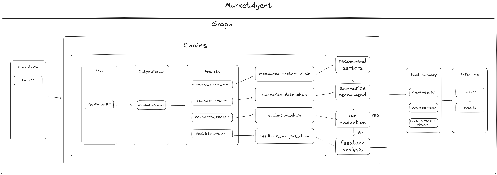

# 📊 FinAgent Phase2: Market Agent

> AI 기반 S&P 500 섹터 분석 및 투자 추천 시스템

[](https://www.python.org/downloads/)
[](./LICENSE)
[](https://www.langchain.com/)
[](https://www.langchain.com/langgraph)

## 🎯 프로젝트 개요

**FinAgent Phase2: Market Agent**는 미국 연방준비제도(Fed)의 거시경제 지표를 종합적으로 분석하여 S&P 500 섹터별 투자 전략을 제시하는 AI 에이전트입니다. LangChain과 LangGraph를 활용한 체계적인 워크플로우를 통해 데이터 수집, 다중 지표 분석, 백테스트, 피드백의 전 과정을 자동화합니다.

### ✨ 주요 기능

- 🏦 **FRED API 연동**: 5가지 주요 거시경제 지표 실시간 수집
  - 기준금리 (Federal Funds Rate)
  - GDP (국내총생산)
  - 실업률 (Unemployment Rate)
  - 비농업 고용자 수 (Non-Farm Payrolls)
  - CPI (소비자물가지수)
- 📈 **S&P 500 섹터 분석**: yfinance를 활용한 11개 주요 섹터 데이터 분석
- 🤖 **다중 지표 기반 AI 추천**: 각 거시경제 지표별 섹터 추천 후 종합 분석
- 🔄 **자동 성과 검증**: 과거 데이터 기반 추천 성과 검증 (최대 5회 반복)
- 💡 **피드백 루프**: 성과 검증 실패 시 자동으로 전략 개선 및 재추천
- 🌐 **웹 인터페이스**: FastAPI + Streamlit 기반 사용자 친화적 대시보드

## 🏗️ 아키텍처

### 📊 시스템 전체 구조




### 데이터 소스

- **FRED API**: 5가지 거시경제 지표 (기준금리, GDP, 실업률, 비농업 고용, CPI)
- **Yahoo Finance API**: S&P 500 섹터별 ETF 데이터 (11개 섹터)

### 📂 프로젝트 구조

```
Phase2-MarketAgent/
├── Agent/                           # AI 에이전트 핵심 로직
│   ├── Chain/                       # LangChain 체인 구현
│   │   └── Chains.py               # 통합 체인 모듈 (추천/요약/성과검증/피드백)
│   ├── Graph/                       # LangGraph 워크플로우
│   │   └── MacroGraph.py           # 거시경제 분석 그래프 (메인 실행 파일)
│   ├── MacroData/                   # 거시경제 데이터 수집 모듈
│   │   ├── FundsRate.py            # 기준금리 데이터
│   │   ├── GDP.py                  # GDP 데이터
│   │   ├── UmEmployMent.py         # 실업률 데이터
│   │   ├── NonFarmPayrolls.py      # 비농업 고용자 수 데이터
│   │   └── CPI.py                  # 소비자물가지수 데이터
│   ├── Prompt/                      # LLM 프롬프트 템플릿
│   │   └── Prompts.py              # 통합 프롬프트 모듈
│   └── Util/                        # 유틸리티 함수
│       ├── LLM.py                  # LLM 생성 및 설정
│       └── Yfinace3moData.py       # 섹터 데이터 처리
├── Apis/                            # 외부 API 연동
│   ├── FredApi.py                  # FRED API 래퍼
│   └── YFinace.py                  # Yahoo Finance API 래퍼
├── InterFace/                       # 웹 애플리케이션 인터페이스
│   ├── FastAPI.py                  # FastAPI 백엔드 서버
│   └── Streamlit.py                # Streamlit 프론트엔드 대시보드
├── requirements.txt                 # 프로젝트 의존성
├── LICENSE                          # MIT 라이선스
└── README.md                        # 프로젝트 문서
```

### 🔑 핵심 모듈 설명

#### **MacroGraph.py** (메인 워크플로우)

- LangGraph를 활용한 전체 분석 파이프라인 정의
- 데이터 초기화 → 섹터 추천 → 요약 → 성과 검증 → 피드백 루프 구현
- `python Agent/Graph/MacroGraph.py`로 직접 실행 가능

#### **Chains.py** (체인 모듈)

- `recommend_sectors_chain`: 거시경제 지표 기반 섹터 추천
- `summarize_data_chain`: 5개 지표 분석 결과 종합
- `evaluation_chain`: 추천 결과 성과 검증
- `feedback_analysis_chain`: 실패 원인 분석 및 개선안 제시
- `final_summary_chain`: 최종 결과 요약

#### **MacroData/** (데이터 수집)

각 거시경제 지표별 FRED API 데이터 수집 및 전처리

- **FundsRate**: 연방기준금리 목표 범위 (상한/하한)
- **GDP**: 미국 GDP 성장률
- **UmEmployMent**: 실업률 데이터
- **NonFarmPayrolls**: 비농업 고용자 수 변화
- **CPI**: 소비자물가지수 및 전월대비 증가율

## 🚀 시작하기

### 📋 사전 요구사항

- Python 3.12
- [uv](https://docs.astral.sh/uv/) (Python 패키지 관리 도구)
- FRED API Key ([무료 발급](https://fred.stlouisfed.org/docs/api/api_key.html))
- OpenRouter API Key
  
### ⚡ 빠른 시작 (uv 사용)

#### 1️⃣ uv 설치

**Windows (PowerShell)**

```powershell
powershell -ExecutionPolicy ByPass -c "irm https://astral.sh/uv/install.ps1 | iex"
```

**macOS/Linux**

```bash
curl -LsSf https://astral.sh/uv/install.sh | sh
```

#### 2️⃣ 프로젝트 클론 및 설정

```bash
# 저장소 클론
git clone https://github.com/Pseudo-Lab/FinAgent-Phase2-MarketAgent.git
cd Phase2-MarketAgent

# Python 3.12 환경 생성 및 의존성 설치
uv venv --python 3.12
uv pip install -r requirements.txt
```

#### 3️⃣ 환경 변수 설정

```bash
# .env 파일 생성
cp .env.example .env
```

`.env` 파일에 API 키를 입력하세요:

```env
# FRED API Key (https://fred.stlouisfed.org/docs/api/api_key.html)
FRED_API_KEY=your_fred_api_key_here

# OpenRouter API Key
OPENROUTER_API_KEY=your_openrouter_api_key_here
```

## 🎬 실행 방법

### 웹 애플리케이션 실행 (권장)

**FastAPI + Streamlit 웹 인터페이스**

```bash
# 모든 서버 한 번에 시작
cd Phase2-MarketAgent
uv run main.py
```


> **Note**: `uv`는 Rust 기반 고속 Python 패키지 관리 도구로, 자동으로 가상환경과 의존성을 관리합니다.

### 실행 과정

프로그램 실행 시 다음 단계가 자동으로 진행됩니다:

1. **데이터 수집**

   - FRED API에서 5가지 거시경제 지표 수집
   - yfinance에서 S&P 500 섹터 데이터 수집
2. **섹터 추천**

   - 각 거시경제 지표별 섹터 분석 및 추천
3. **종합 분석**

   - 5개 지표 결과를 종합하여 최종 3개 섹터 선정
4. **성과 검증**

   - 현재 시점까지 데이터로 추천 성과 검증
5. **피드백 루프** (필요시)

   - 성과 검증 실패 시 최대 5회까지 전략 개선 및 재추천
6. **최종 요약**

   - 분석 결과 및 투자 전략 출력


## 📊 분석 워크플로우

### 1단계: 데이터 초기화 (Initialize Data)

- FRED API에서 5가지 거시경제 지표 수집 (2008년~현재)
- yfinance에서 S&P 500 섹터 데이터 수집
- 3개월 전 시점 데이터 분리 (분석용)

### 2단계: 섹터 추천 (Recommend Sectors)

각 거시경제 지표별로 독립적인 섹터 추천 수행:

1. **기준금리 분석** → 추천 섹터
2. **GDP 분석** → 추천 섹터
3. **실업률 분석** → 추천 섹터
4. **비농업 고용 분석** → 추천 섹터
5. **CPI 분석** → 추천 섹터

### 3단계: 종합 분석 (Summarize)

- 5개 지표의 추천 결과를 종합
- 가장 유망한 3개 섹터 최종 선정
- 선정 이유 및 전략 제시

### 4단계: 성과 검증 (Evaluation)

- 현재 시점까지의 실제 데이터로 검증
- 추천 섹터의 실제 성과 평가
- **Success** / **Failed** 판정

### 5단계: 피드백 루프 (Feedback Analysis)

성과 검증 **Failed** 시:

- 실패 원인 분석
- 현재 시장 상황 재평가
- 개선된 추천 섹터 제시
- 성과 검증 재실행 (최대 5회 반복)

성과 검증 **Success** 시:

- 최종 요약 생성 후 종료

## 🤝 기여하기


## 📄 라이선스

이 프로젝트는 MIT 라이선스 하에 배포됩니다. 자세한 내용은 [LICENSE](./LICENSE) 파일을 참조하세요.

## 👥 팀

**Pseudo Lab - FinAgent Team**

프로젝트 팀장: 손봉균

---

<div align="center">
Made with ❤️ by Pseudo Lab FinAgent Team
</div>
```
