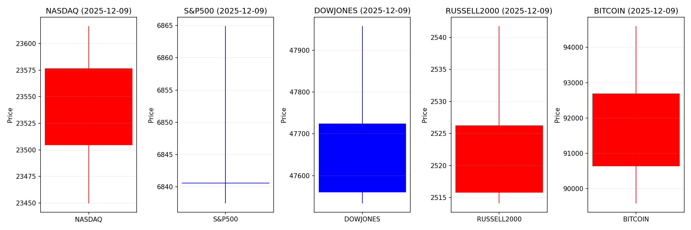
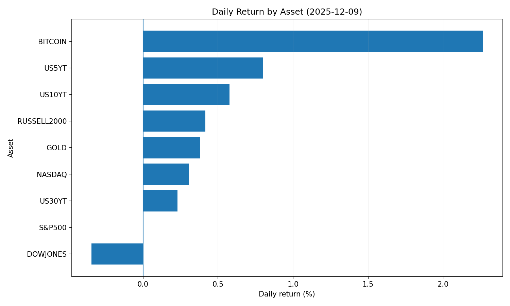
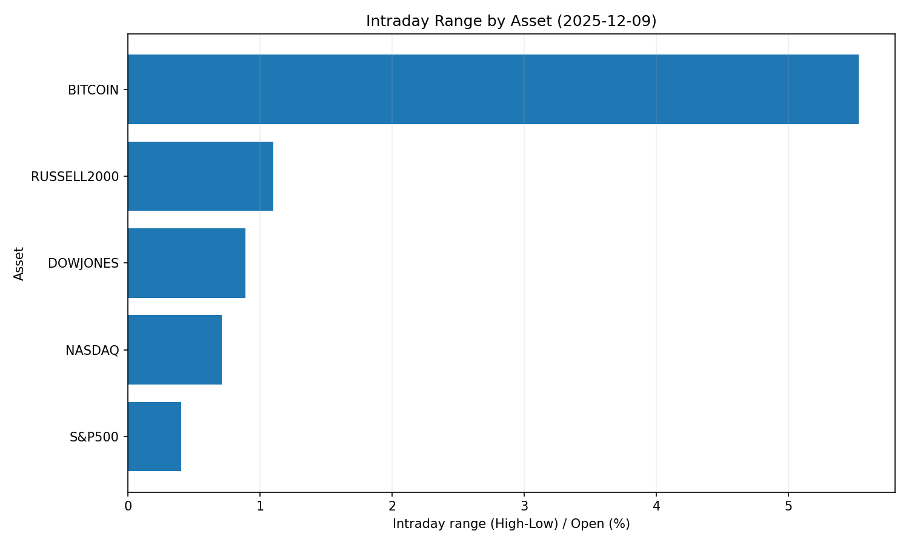
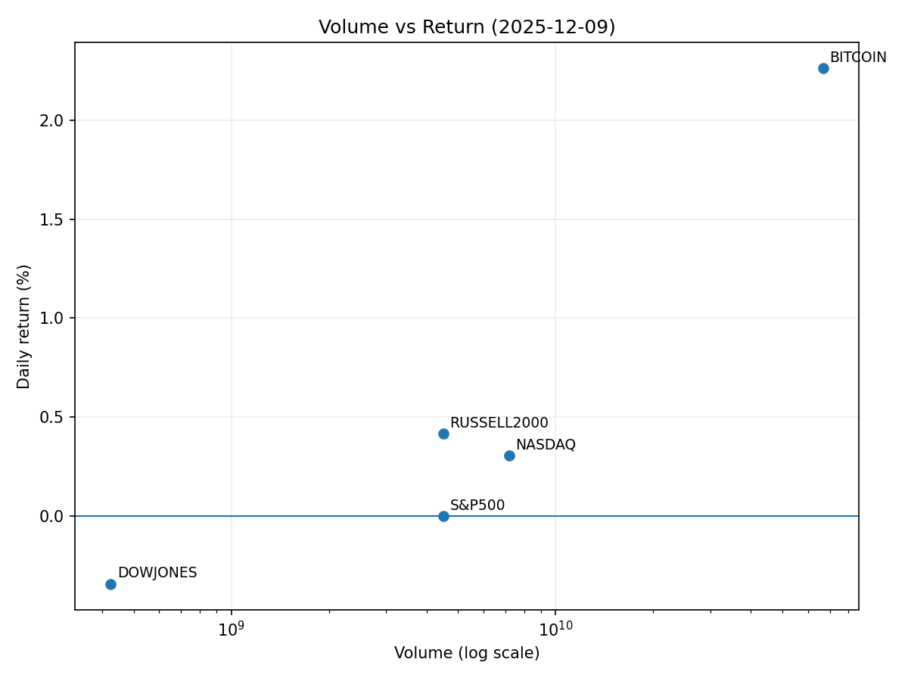

# Market Overview
| stock            | date       |      Open |      High |       Low |     Close |        Volume |   ret_pct |   range_pct |   close_over_open |   candle_dir |
|:-----------------|:-----------|----------:|----------:|----------:|----------:|--------------:|----------:|------------:|------------------:|-------------:|
| NASDAQ           | 2025-12-09 | 23504.6   | 23616.5   | 23449.7   | 23576.5   |   7.1926e+09  |  0.305816 |    0.709352 |          1.00306  |            1 |
| S&P500           | 2025-12-09 |  6840.61  |  6864.92  |  6837.43  |  6840.51  |   4.50805e+09 | -0.001463 |    0.401861 |          0.999985 |           -1 |
| DOWJONES         | 2025-12-09 | 47724.5   | 47957.8   | 47533.6   | 47560.3   |   4.2547e+08  | -0.344122 |    0.888825 |          0.996559 |           -1 |
| RUSSELL2000      | 2025-12-09 |  2515.79  |  2541.77  |  2514.09  |  2526.24  |   4.50805e+09 |  0.415375 |    1.10025  |          1.00415  |            1 |
| USD/KRW          | 2025-12-09 |  1468.51  |  1472.08  |  1465.49  |  1468.51  |   0           |  0        |    0.448752 |          1        |            0 |
| Dallor Index/USD | 2025-12-09 |    99.05  |    99.31  |    98.95  |    99.22  |   0           |  0.171629 |    0.363453 |          1.00172  |            1 |
| GOLD             | 2025-12-09 |  4190.7   |  4219.7   |  4177.7   |  4206.7   | 660           |  0.381798 |    1.00222  |          1.00382  |            1 |
| BITCOIN          | 2025-12-09 | 90639.7   | 94601.6   | 89587     | 92691.7   |   6.68617e+10 |  2.26392  |    5.53245  |          1.02264  |            1 |
| US5YT            | 2025-12-09 |     3.75  |     3.783 |     3.729 |     3.78  |   0           |  0.799999 |    1.44     |          1.008    |            1 |
| US10YT           | 2025-12-09 |     4.162 |     4.19  |     4.143 |     4.186 |   0           |  0.576638 |    1.12926  |          1.00577  |            1 |
| US30YT           | 2025-12-09 |     4.798 |     4.814 |     4.775 |     4.809 |   0           |  0.229265 |    0.812839 |          1.00229  |            1 |

# 2025-12-09 투자 리포트 핵심 요약

## 1. 오늘의 핵심 이슈
- **FOMC 금리 정책 불확실성**:  
  - 연준의 금리 인하 시기 및 규모에 대한 시장 기대와 정책 기조 간 괴리 확대  
  - 달러 강세 지속(WON/USD 1,470원대 돌파) 및 아시아 신흥국 통화 약세 심화  
  - 장기금리 상승 우려로 주식 밸류에이션 리스크 재점화  

- **한국 투자자의 미주식 집중**:  
  - 국내 개인 투자자의 對美 순매수액 역대 최대 기록(41조원↑) → 원화 약세 압력 가속  
  - 증권사 AI 투자비서 확대로 "서학개미" 열풍 지속 → 미 대형주 유동성 지원  

- **메가 M&A 리스크**:  
  - 워너브러더스 인수전 격화(파라마운트 vs 넷플릭스)로 미디어 시장 재편 가속  
  - 정치적 개입(트럼프 연계) 및 반독점법 위반 논란 → 규제 당국 심사 리스크 부각  

---

## 2. 시장 동향 요약
### 🔄 부문별 흐름
| 섹터            | 동향                                                                 | 특이사항                     |
|-----------------|----------------------------------------------------------------------|------------------------------|
| **통화/환율**   | 달러 강세(WON, JPY 약세)                                            | FOMC 경계감으로 변동성 확대  |
| **미국 주식**   | 테크주 강세(테슬라↑), 金利 민감株 약세                              | 외국인 한국 증시 순매도 지속 |
| **채권**        | 단기채 변동성↑ / 장기채 수요 회복 기대                              | 금리 인하 기대 반영         |
| **암호화폐**    | 비트코인 9만달러 돌파 시도(금리인하 기대) / DOGE ETF 유동성 급감    | 기관 매수 확대(Stratis 등)  |
| **원자재**      | 달러 강세+성장 둔화로 구리 등 하방 압력 / 金은 안전자산 수요↑       | 전력 인프라 수혜상품 주목   |

### ⚡ 주요 변동성 요인
- **FOMC 언론 발표**: 파월 의장 발언 및 점도표 수정 가능성  
- **정치 리스크**: 美 대선 예측 시장 성장(+12억 달러 거래량), 무역 갈등 재연(인도 쌀 관세)  
- **업종 편중 현상**: 국내 투자자 테슬라 편중 보유 → 급변동 시 포트폴리오 충격  

---

## 3. 투자 시사점
### 🔍 주목 포인트
- **통화정책 모니터링**:  
  - 연준의 ①금리인하 시기 ②인플레이션 평가 ③구어적 통신(forward guidance) 분석 필요  
  - 달러 강세 지속 시 신흥국 통화 헤징 전략 검토  

- **포트폴리오 리스크 관리**:  
  - 미주식 과열 편중 분산 → 인프라/부동산(연 10% 수익율 예상), 디펜시브 섹터 편입 고려  
  - 변동성 확대기에 단기 레버리지 전략 제한  

- **테마별 기회**:  
  - **AI 연관株**: 반도체(엔비디아 수혜), 데이터센터(IREN CB 발행)  
  - **대체투자**: 암호화폰(기관 매수 확대), 원자재(구리·銀 수급 긴장)  
  - **한국 수혜株**: 조선(수주 모멘텀), 바이오(생보법 개정 기대)  

- **글로벌 리스크**:  
  - 中 위안화 절상 움직임 → 달러 헤게모니 약화 시나리오 대비  
  - 美 선거기 미디어 M&A 규제 강화 가능성 → 관련株 공매도 회피  

> **핵심 액션플랜**: FOMC 결과에 따른 ①달러 헤징 ②성장주 vs 가치주 재배분 ③변동성 확대기 분산투자 실행
