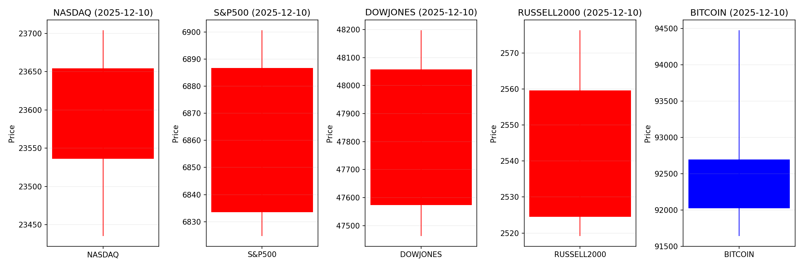
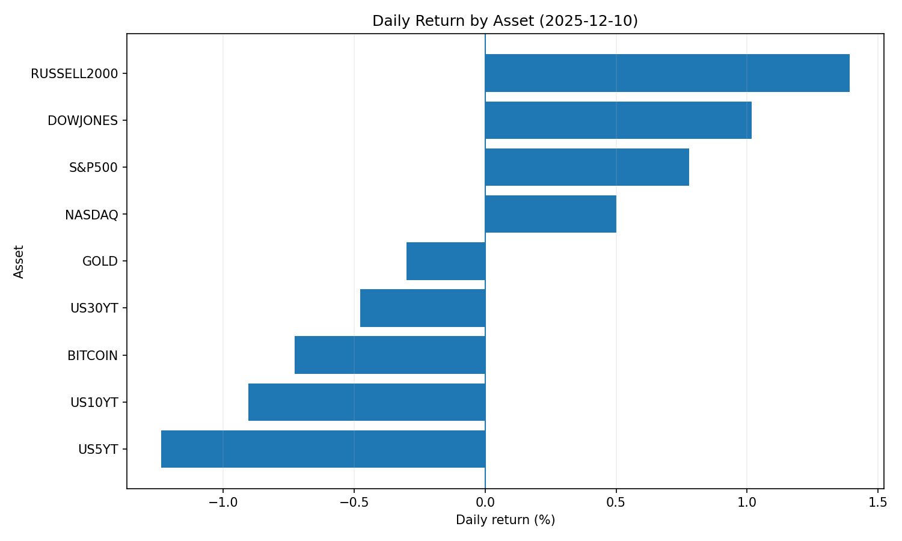
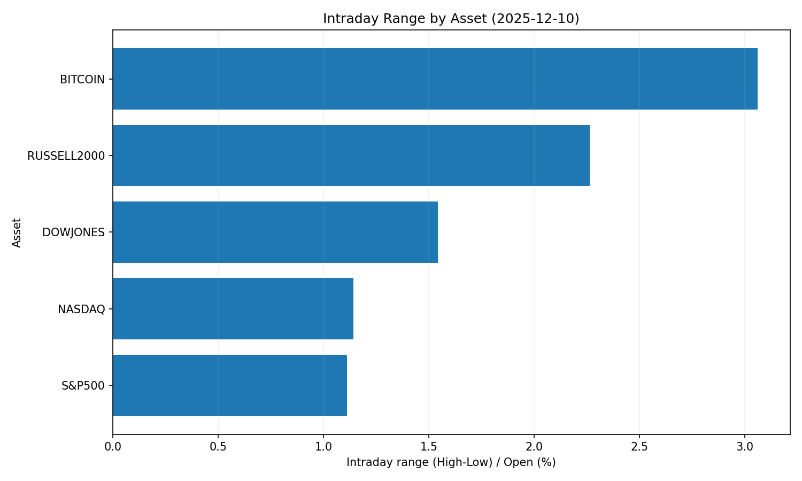
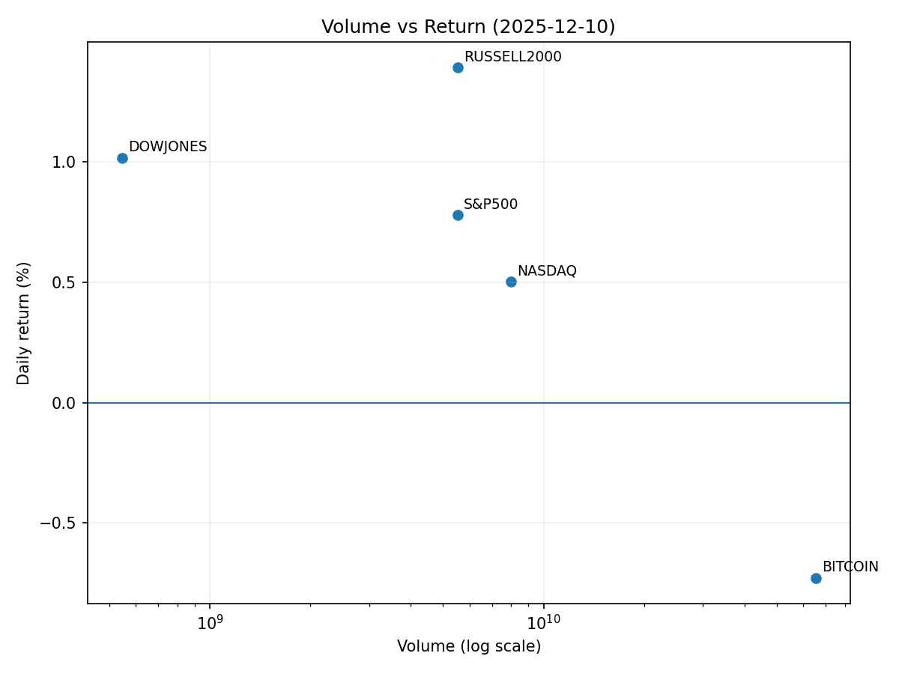

# Market Overview
| stock            | date       |      Open |      High |       Low |     Close |        Volume |   ret_pct |   range_pct |   close_over_open |   candle_dir |
|:-----------------|:-----------|----------:|----------:|----------:|----------:|--------------:|----------:|------------:|------------------:|-------------:|
| NASDAQ           | 2025-12-10 | 23536     | 23704.1   | 23435.2   | 23654.2   |   7.9879e+09  |  0.501999 |    1.14255  |          1.00502  |            1 |
| S&P500           | 2025-12-10 |  6833.49  |  6900.67  |  6824.69  |  6886.68  |   5.52657e+09 |  0.778372 |    1.11188  |          1.00778  |            1 |
| DOWJONES         | 2025-12-10 | 47574     | 48197.3   | 47462.9   | 48057.8   |   5.4561e+08  |  1.01692  |    1.54362  |          1.01017  |            1 |
| RUSSELL2000      | 2025-12-10 |  2524.48  |  2576.31  |  2519.17  |  2559.61  |   5.52657e+09 |  1.39158  |    2.26344  |          1.01392  |            1 |
| USD/KRW          | 2025-12-10 |  1467.93  |  1472.35  |  1467.51  |  1467.93  |   0           |  0        |    0.329714 |          1        |            0 |
| Dallor Index/USD | 2025-12-10 |    99.22  |    99.26  |    98.59  |    98.79  |   0           | -0.433381 |    0.675273 |          0.995666 |           -1 |
| GOLD             | 2025-12-10 |  4209     |  4234.5   |  4183.6   |  4196.4   | 692           | -0.299361 |    1.20931  |          0.997006 |           -1 |
| BITCOIN          | 2025-12-10 | 92695.2   | 94477.2   | 91640.1   | 92020.9   |   6.54207e+10 | -0.727426 |    3.06059  |          0.992726 |           -1 |
| US5YT            | 2025-12-10 |     3.804 |     3.806 |     3.738 |     3.757 |   0           | -1.23554  |    1.78759  |          0.987645 |           -1 |
| US10YT           | 2025-12-10 |     4.202 |     4.204 |     4.147 |     4.164 |   0           | -0.904334 |    1.3565   |          0.990957 |           -1 |
| US30YT           | 2025-12-10 |     4.82  |     4.822 |     4.771 |     4.797 |   0           | -0.477183 |    1.05809  |          0.995228 |           -1 |

# 2025-12-10 투자 리포트 요약

## 1. 오늘의 핵심 이슈

### **1. 센티콘(Centicorn)의 역대 최대 규모 IPO 준비**
- **기업가치 1,380조 원(1,000억 달러)을 돌파**한 미국 비상장 테크 기업의 상장 움직임 주목
- 글로벌 자본시장 유동성 증가 및 테크주 중심 시가총액 확대 기대
- **규제 리스크 대비 필요성** 대두 (반독점 논의 재점화 가능성)

### **2. 테슬라 연계 혼합형 채권 ETF 출시**
- 한화자산운용의 **월배당 상품** 출시 (연 24% 목표 수익률)
- **50% 콜옵션 매도 + 50% 주가 상승 노출** 구조로 안정성과 수익 균형
- 미·중 기술 패권 경쟁 심화에 따른 로봇/AI 산업 투자 확대 전망 반영

### **3. 자산 거품 경고 및 금 가격 급등**
- **BIS, 금·주식 동시 거품 경고** (50년 만에 최초)
- 금값 **온스당 60달러 돌파** (연간 100%↑)  
- 인플레이션 재점화 및 Fed 금리 인하 속도 제한 가능성 시사

---

## 2. 시장 동향 요약

### **테크/AI 섹터**
- **AI 버블 논란 vs 닷컴 버블과 차별화**  
  - AI 기업 시가총액 합산 17조 달러↑ (닷컴 버블 전체 시장 규모 초과)  
  - 실질적 수익 창출 능력으로 닷컴 대비 안정성 우위 평가
- **AI 인프라 수혜주 강세**  
  - 시게이트 주가 227%↑ (AI 서버 수요로 HDD 저장장치 호황)  
  - 반도체·스토리지株 추가 상승 가능성↑

### **안전자산 선호 트렌드**
- **단기 미 국채 ETF 수요 급증**  
  - 미래에셋 자산운용 ETF 누적 순매수 1,000억 원↑  
  - **환율 리스크 헤지 + 주식 차익실현 자금 보관** 목적
- **금·은 매입 증가**  
  - 인플레이션 우려와 달러 강세 속 **안전자산 수요 확대**

### **규제 및 글로벌 자금 흐름**
- **암호화폐 규제 개편 추진**  
  - SEC, "토큰 증권" 중심 체계 전환 예고 → 금융주 변동성↑  
  - 전통 금융사 vs 탈중앙화 거래소(DEX) 갈등 심화
- **아시아 증시 유입 가속화**  
  - 미국 대비 **저평가 + 공급망 재편 수혜** 기대  
  - 韓·대만 기술주 중심 투자 확대 전망  

---

## 3. 투자 시사점

### **주목해야 할 3대 포인트**
| 분야 | 주요 내용 | 투자 전략 |
|------|----------|------------|
| **테크/AI** | - 센티콘 IPO 성공 시 테크주 유동성↑   - AI 인프라(반도체·스토리지) 수요 지속 | - 대형 테크주 편입   - AI 연관 2차 산업(희토류·합금) 검토 |
| **포트폴리오 전략** | - 60/40 포트폴리오 효율성↓   - 주식-채권 동행성 심화 | - 대체자산(인프라, 사모권) 비중↑   - 혼합형 상품(테슬라 ETF 등) 편입 |
| **지역별 리스크** | - 아시아 증시로 자금 이동 가속   - 원화 약세 장기화 가능성 | - 아시아 저평가株(韓 반도체) 포트폴리오 다변화   - USD/KRW 헤지를 위한 단기 국채 ETF 활용 |

### **위험 요인**
- **금리 정책 변동성**  
  - 연준 "매파적 금리 인하" 가능성 → 주식-채권 시장 동시 조정 리스크↑
- **자산 거품 조정**  
  - BIS 경고에 따른 고평가株 차익매도 압력↑ (특히 미국 테크주)
- **규제 리스크**  
  - 암호화폐·반독점 규제 강화로 테크주 일시적 약세 가능성

> **핵심 결론**: 테크/AI 산업의 구조적 성장은 지속될 전망이나, 클라우드, 반도체 등 실적 견인력 있는 종목 우선 편입 필요. 단기 변동성 관리 위해 안전자산 비중을 20% 내외로 유지하고, 아시아 저평가 자산으로 지역 다각화 권고.
