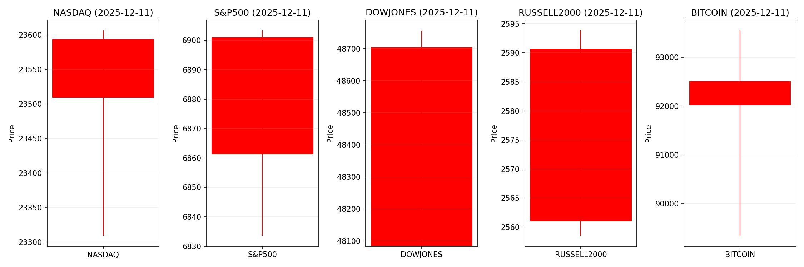
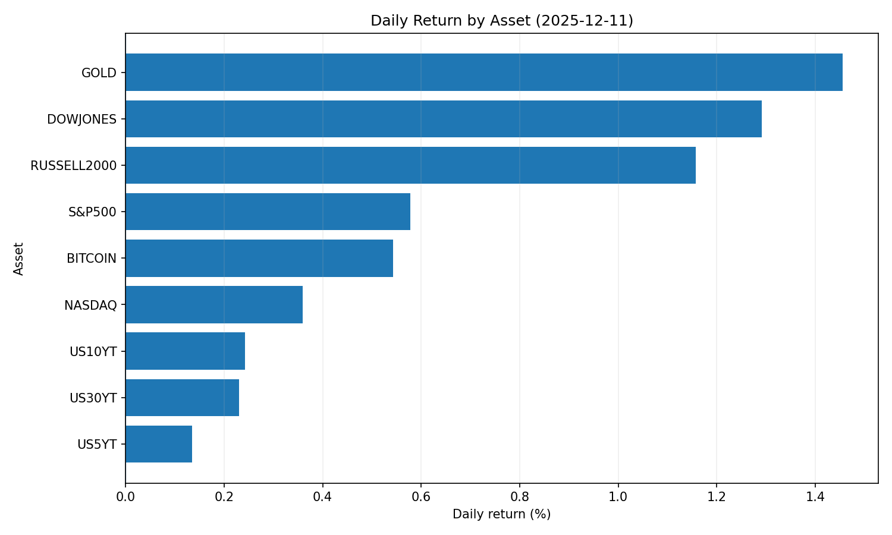
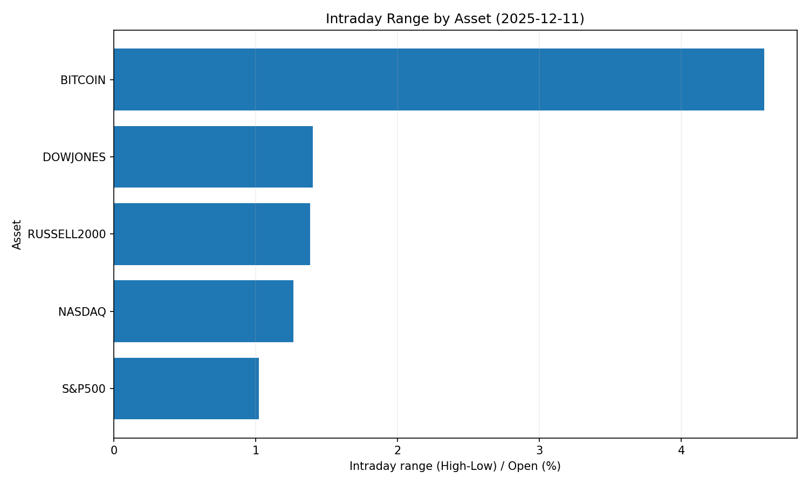
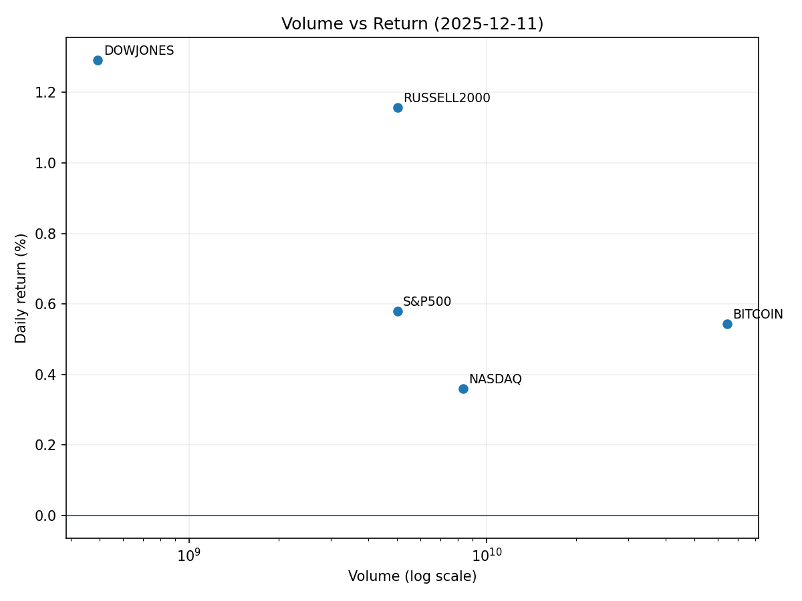

# Market Overview
| stock            | date       |      Open |      High |       Low |     Close |        Volume |   ret_pct |   range_pct |   close_over_open |   candle_dir |
|:-----------------|:-----------|----------:|----------:|----------:|----------:|--------------:|----------:|------------:|------------------:|-------------:|
| NASDAQ           | 2025-12-11 | 23509.2   | 23606.7   | 23308.9   | 23593.9   |   8.33777e+09 |  0.360023 |    1.26652  |          1.0036   |            1 |
| S&P500           | 2025-12-11 |  6861.3   |  6903.46  |  6833.45  |  6901     |   5.02106e+09 |  0.57861  |    1.02036  |          1.00579  |            1 |
| DOWJONES         | 2025-12-11 | 48082.9   | 48756.3   | 48082.9   | 48704     |   4.9395e+08  |  1.29175  |    1.40058  |          1.01292  |            1 |
| RUSSELL2000      | 2025-12-11 |  2560.98  |  2593.89  |  2558.46  |  2590.61  |   5.02106e+09 |  1.15698  |    1.38345  |          1.01157  |            1 |
| USD/KRW          | 2025-12-11 |  1462.55  |  1473.93  |  1462.55  |  1469.04  |   0           |  0.443745 |    0.778093 |          1.00444  |            1 |
| Dallor Index/USD | 2025-12-11 |    98.56  |    98.76  |    98.13  |    98.35  |   0           | -0.213067 |    0.63921  |          0.997869 |           -1 |
| GOLD             | 2025-12-11 |  4224     |  4286.9   |  4214.3   |  4285.5   | 528           |  1.45597  |    1.71875  |          1.01456  |            1 |
| BITCOIN          | 2025-12-11 | 92011.3   | 93554.3   | 89335.3   | 92511.3   |   6.45328e+10 |  0.543445 |    4.58527  |          1.00543  |            1 |
| US5YT            | 2025-12-11 |     3.71  |     3.72  |     3.679 |     3.715 |   0           |  0.134768 |    1.10512  |          1.00135  |            1 |
| US10YT           | 2025-12-11 |     4.131 |     4.143 |     4.102 |     4.141 |   0           |  0.242066 |    0.992493 |          1.00242  |            1 |
| US30YT           | 2025-12-11 |     4.779 |     4.794 |     4.749 |     4.79  |   0           |  0.230177 |    0.941621 |          1.0023   |            1 |

### 2025-12-11 주식 및 경제 뉴스 핵심 요약

---

#### **1. 오늘의 핵심 이슈**  
1. **한미 금리차 1.25%p 축소**  
   - 원화 강세 및 한국 증시 외국인 유입 기대 ↑  
   - 달러 약세 압력 가중, 미국 내 아시아 자본 이전 가능성 대두  
   - 한국 국채 수요 증가 전망 (금리차 축소에 따른 투자 매력도 상승)  

2. **암호화폐 거래량 감소 (로빈후드 12%↓)**  
   - 미국 소매 투자자들의 위험 회피 심리 확대 반영  
   - 테크/밈주 등 고변동성 주식 약세 및 안전자산(채권·금) 수요 증가 예상  
   - SEC 규제 강화와 연준 고금리 정책이 주요 원인으로 분석  

3. **150조 규모 반도체 투자펀드 추진**  
   - TSMC 등 글로벌 기업의 ADR 발행 확대로 미 증시 유동성 유입 ↑  
   - 장비·소재株 수혜 예상,但 기업채 공급 증가 리스크 (신용 스프레드 확대 우려)  

---

#### **2. 시장 동향 요약**  
| **섹터**       | **흐름**                                                                 | **특이사항**                                       |  
|----------------|--------------------------------------------------------------------------|---------------------------------------------------|  
| **금융시장**   | - FOMC 금리 인하(0.25%p) 반등 효과 → 글로벌 증시 단기 상승              | - 원·달러 환율 변동성 확대 (구조적 달러 수요 영향) |  
| **반도체**     | - 국가적 투자 확대 (한반도 150조 펀드) → 장비·소재株 강세               | - 설비투자 비용↑로 TSMC ADR 발행 검토             |  
| **암호화폐**   | - 거래량 감소(로빈후드 12%↓) → 안전자산(장기채·금) 수요 ↑                | - 규제 강화 및 고금리 정책이 주요 악재            |  
| **의약/바이오**| - 제약株 분화 심화 (일동제약·홀딩스 兩자리數 상승세)                     | - 젬백스 주식 압류 이슈로 바이오株 변동성 확대    |  
| **부동산**     | - 연준 금리 인하 효과 (하림지주 상한가) → 부동산 개발株 수혜            | - 저금리 기조 지속 시 추가 상승 가능성 有         |  

---

#### **3. 투자 시사점**  
- **환율·금리 정책 모니터링**  
  - 미 연준의 **금리 인하 경로**에 따라 신흥국 변동성 리스크 상존 (달러 약세 지속 시 원화 강세 전망)  
  - 한미 금리차 축소로 **한국 증시 외국인 유입** 증가 기대 (특히 반도체/전자 업종)  

- **섹터별 선택적 투자 필요**  
  - **긍정적**: 반도체 장비·소재, 부동산(리츠), 방어형(헬스케어/유틸리티)  
  - **주의 필요**: 고변동성 테크/밈주, 암호화폐 연관株  

- **지역 다각화 전략 강화**  
  - **미국 집중 리스크 분산** (유럽·일본·한국 비중 확대)  
  - 한국 주식의 **상대적 저평가** 및 AI 생태계 수혜 종목(삼성·SK하이닉스) 관심 요구  

- **단기 리스크 요인**  
  - **기업채 공급↑**으로 신용 스프레드 확대 우려 (반도체 투자 자금 조달 영향)  
  - 상반기 **미중 무역 갈등 재발 가능성**에 따른 공급망 변동성 대비  

--- 

> **🎯 핵심 액션 포인트**:  
> - **반도체 장비·소재株** 투자 검토 (글로벌 공급망 재편 수혜)  
> - **한국 증시** 외국인 유입 실적株(삼성전자, SK하이닉스 등) 편입  
> - **달러 약세 지속** 시 비달러 자산(원화·엔화) 및 금 매수 전략 고려  
