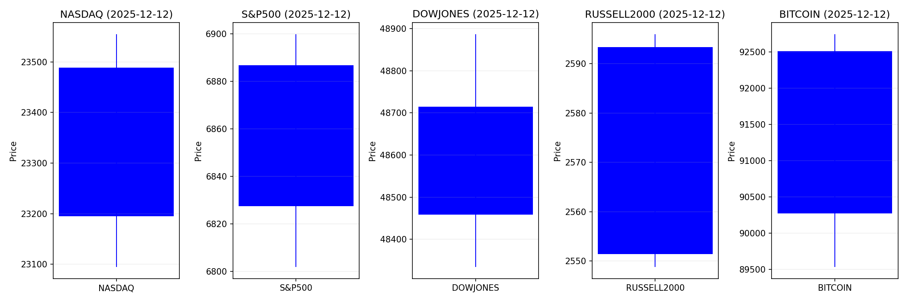
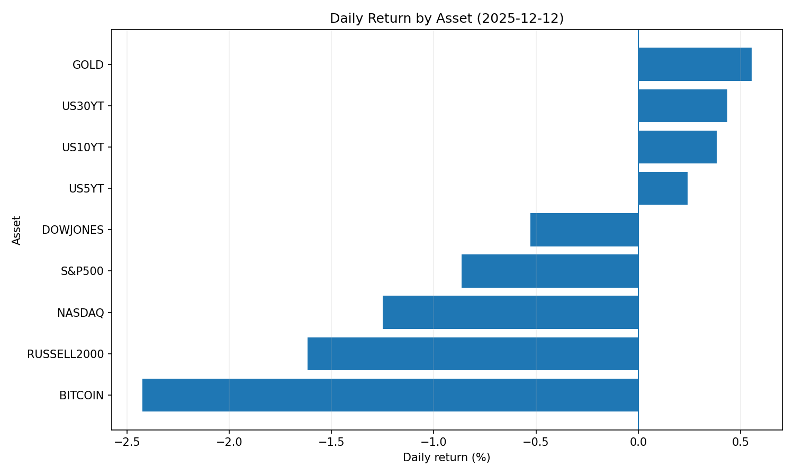
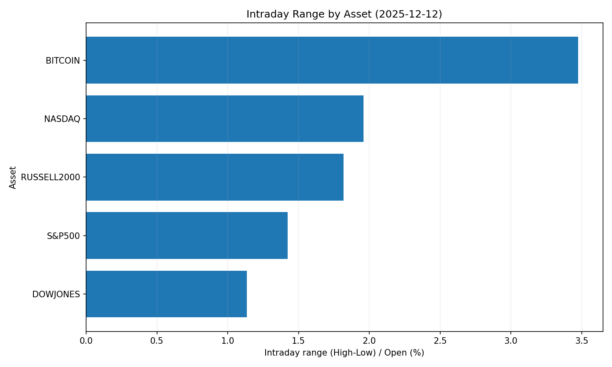
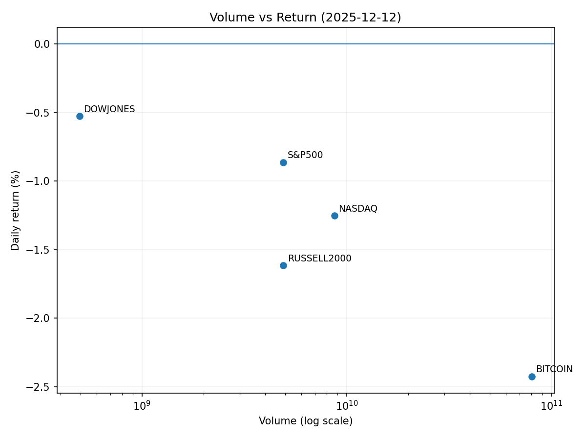

# Market Overview
| stock            | date       |      Open |      High |       Low |     Close |         Volume |   ret_pct |   range_pct |   close_over_open |   candle_dir |
|:-----------------|:-----------|----------:|----------:|----------:|----------:|---------------:|----------:|------------:|------------------:|-------------:|
| NASDAQ           | 2025-12-12 | 23488.9   | 23554.9   | 23094.5   | 23195.2   |    8.72407e+09 | -1.25038  |    1.96     |          0.987496 |           -1 |
| S&P500           | 2025-12-12 |  6886.85  |  6899.85  |  6801.79  |  6827.41  |    4.91016e+09 | -0.863093 |    1.42387  |          0.991369 |           -1 |
| DOWJONES         | 2025-12-12 | 48714.8   | 48886.9   | 48334.1   | 48458.1   |    4.9583e+08  | -0.526944 |    1.13468  |          0.994731 |           -1 |
| RUSSELL2000      | 2025-12-12 |  2593.36  |  2595.98  |  2548.81  |  2551.46  |    4.91016e+09 | -1.61567  |    1.81887  |          0.983843 |           -1 |
| USD/KRW          | 2025-12-12 |  1471.58  |  1479.65  |  1469.4   |  1470.85  |    0           | -0.049605 |    0.69653  |          0.999504 |           -1 |
| Dallor Index/USD | 2025-12-12 |    98.32  |    98.53  |    98.3   |    98.4   |    0           |  0.081369 |    0.233926 |          1.00081  |            1 |
| GOLD             | 2025-12-12 |  4276.4   |  4355     |  4260     |  4300.1   | 1531           |  0.554209 |    2.22149  |          1.00554  |            1 |
| BITCOIN          | 2025-12-12 | 92513.7   | 92747.9   | 89532.6   | 90270.4   |    8.02759e+10 | -2.42478  |    3.47552  |          0.975752 |           -1 |
| US5YT            | 2025-12-12 |     3.742 |     3.759 |     3.735 |     3.751 |    0           |  0.240508 |    0.641373 |          1.0024   |            1 |
| US10YT           | 2025-12-12 |     4.178 |     4.2   |     4.178 |     4.194 |    0           |  0.382953 |    0.526564 |          1.00383  |            1 |
| US30YT           | 2025-12-12 |     4.837 |     4.867 |     4.835 |     4.858 |    0           |  0.434152 |    0.661568 |          1.00434  |            1 |

## 📊 2025-12-12 투자 리포트 핵심 요약

---

### 1. **오늘의 핵심 이슈**
#### ▶ **대마초 산업 규제 완화 기대감**  
- 트럼프 전 대통령의 연방 차원 대마초 규제 완화 시사로 TLRY, Canopy Growth 등 관련주 급등(38%↑).  
- 산업 성장 기대에 따른 투자 유입 확대 가능성 있으나, 대선 결과에 따른 정책 변동성 우려.

#### ▶ **미국-중국 반도체 기술 패권 경쟁 심화**  
- 미국의 NVIDIA 고성능 AI 칩 수출 규제 강화로 중국 내 자립화 가속 및 '차이나판 엔비디아'(무어스레드) 주목.  
- 기술 분쟁 장기화로 친미 국가 공급망 재편 및 반도체 소형주 변동성 확대 전망.

#### ▶ **비트코인 ETF 승인에 따른 암호화폐 시장 변동성**  
- BTC 현물 ETF 출시 기대감으로 가격 사상 최고가(94,600달러) 경신.  
- 단기 과열 조정 우려(연준 촉매 부재) vs 장기적 기관 투자 유입 확대 기대 상충.

---

### 2. **시장 동향 요약**
#### ✔ **섹터별 흐름**
| **섹터** | **동향** | **주요 이슈** |
|----------|----------|--------------|
| **대마초** | 급증세 | 규제 완화 기대 → TLRY·Canopy Growth 2자릿수 상승. |
| **반도체** | 양극화 | 美 Big Tech(엔비디아·AMD) 호황 vs 中 소형주 변동성 증가. |
| **암호화폐** | 혼조세 | BTC ETF 기대감 ↔ 기술적 약세 패턴('베어 플래그') 병존. |
| **디지털 자산** | 확장 | 토큰화 주식·미 국채 거래 승인(DTCC) → 유동성 개선 기대. |
| **기술 (AI)** | 강세 | 엔비디아 시총 5조 달러 돌파, Big Tech 실적 견인. |

#### ✔ **특이사항**
- **암호화폐-주식 디커플링**: S&P500 상승에도 BTC 독자적 약세 → 자산 상관관계 재평가 필요.  
- **한국 자본 유출 심화**: 해외주식 투자 확대(메리츠증권 수수료 면제)로 USD/KRW 환율 상방 압력 지속.

---

### 3. **투자 시사점**
#### 💡 **주요 포커스 전략**
- **대마초 테마주의 전략적 접근**:  
  - 단기: 정치적 리스크 감안한 과열 종목 수익실현 권장.  
  - 장기: 규제 완화 시 의료·레크리에이션 용도 확대 가능 기업 스크리닝.

- **반도체 공급망 다각화 수혜주**:  
  - 美-중脫 가속화에 따른 대만·베트남 기반 설비·소재 기업 편입 고려.  
  - 중국 내 AI 칩 수요 대응 가능한 美 선두 기업(엔비디아) 우선 투자.

- **암호화폐 시장 리스크 관리**:  
  - BTC ETF 승인 심사 속도 모니터링 및 레버리지 포지션 회피.  
  - 금리 인하 시 위험자산 선호 전환 가시화 전까지 유동성 확보 유지.

- **토큰화 자산 전략적 포트폴리오 편입**:  
  - 블록체인 기반 유동성 향상 종목(미 대형주·국채 연계 ETF) 장기 편입.  
  - 전통 금융사(코인베이스·로빈후드)의 디지털 시장 진출 성장성 주목.

- **환율 리스크 헤징**:  
  - 달러 강세 지속 예상 → 수출 의존 美 기업 대비 원자재·환율 헤지 상품 활용.  
  - 한국 투자자 對美 주식 투자 확대에 따른 원화 추가 약세 대비.

#### ⚠ **위험 관리 포인트**
- **정치적 변동성**: 대선 결과에 따른 대마초·반도체 정책 급변 가능성 대비.  
- **AI 투자 리스크**: 엔비디아 성장세 유지 우려 vs 오라클급 재정 악화 사례 필터링.  
- **글로벌 유동성 분화**: 달러 강세 기조하 신흥국 시장 자금 이탈 모니터링.

---

### 🔍 **종합 평가**
- **테마 전환 가속화**: 대마초·토큰화 등 신규 테마 vs 반도체·AI 등 기존 트렌드 공존.  
- **글로벌 자금 흐름**: 美 달러 강세 → 안전자산(美 국채) 및 디지털 자산(토큰화) 수요 집중.  
- **코어 전략**: 단기 변동성 활용(대마초·암호화폐)보다 장기 성장 지속성(反도체·AI)에 가중치.
