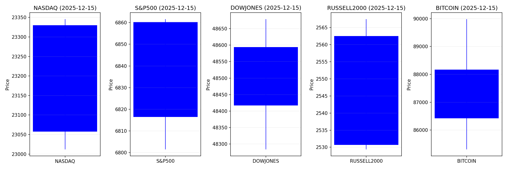
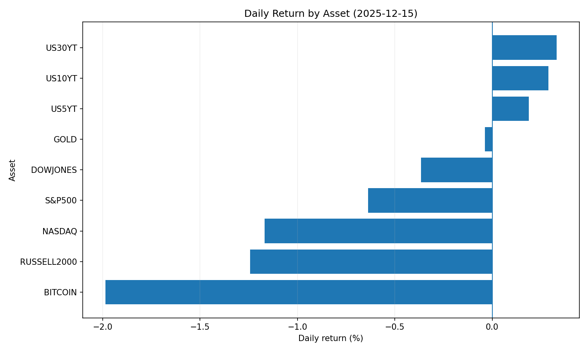
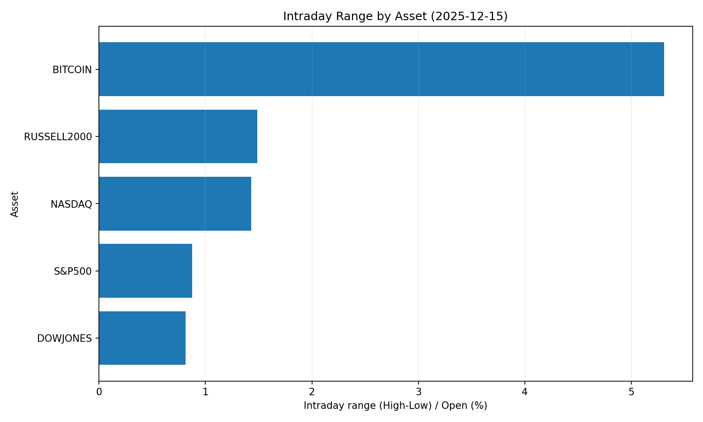
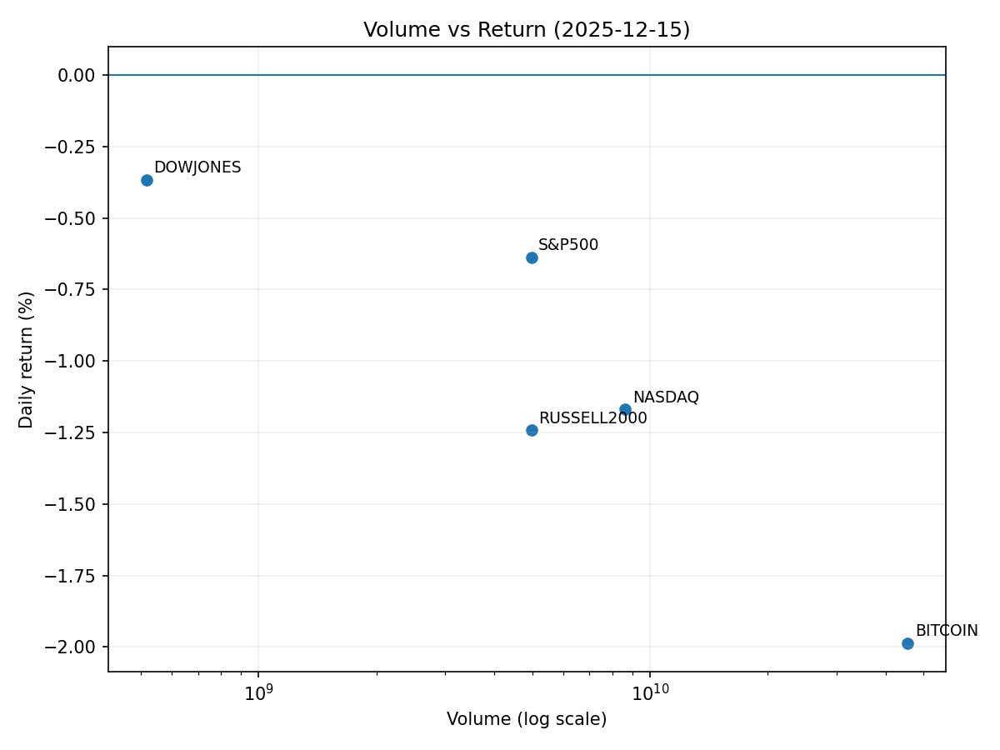

# Market Overview
| stock            | date       |      Open |      High |       Low |     Close |        Volume |   ret_pct |   range_pct |   close_over_open |   candle_dir |
|:-----------------|:-----------|----------:|----------:|----------:|----------:|--------------:|----------:|------------:|------------------:|-------------:|
| NASDAQ           | 2025-12-15 | 23330     | 23345.6   | 23012     | 23057.4   |   8.64924e+09 | -1.16857  |    1.42975  |          0.988314 |           -1 |
| S&P500           | 2025-12-15 |  6860.19  |  6861.59  |  6801.49  |  6816.51  |   4.9756e+09  | -0.63672  |    0.876063 |          0.993633 |           -1 |
| DOWJONES         | 2025-12-15 | 48594.4   | 48679.1   | 48283.3   | 48416.6   |   5.1663e+08  | -0.365888 |    0.814644 |          0.996341 |           -1 |
| RUSSELL2000      | 2025-12-15 |  2562.5   |  2567.46  |  2529.37  |  2530.67  |   4.9756e+09  | -1.24215  |    1.48643  |          0.987579 |           -1 |
| USD/KRW          | 2025-12-15 |  1472.91  |  1477.75  |  1462.42  |  1472.91  |   0           |  0        |    1.04079  |          1        |            0 |
| Dallor Index/USD | 2025-12-15 |    98.4   |    98.48  |    98.14  |    98.15  |   0           | -0.254065 |    0.345532 |          0.997459 |           -1 |
| GOLD             | 2025-12-15 |  4308.3   |  4349.2   |  4292.9   |  4306.7   | 854           | -0.037129 |    1.30679  |          0.999629 |           -1 |
| BITCOIN          | 2025-12-15 | 88171.1   | 89983.9   | 85304.1   | 86419.8   |   4.55595e+10 | -1.98625  |    5.30769  |          0.980138 |           -1 |
| US5YT            | 2025-12-15 |     3.726 |     3.738 |     3.701 |     3.733 |   0           |  0.187868 |    0.99302  |          1.00188  |            1 |
| US10YT           | 2025-12-15 |     4.17  |     4.186 |     4.151 |     4.182 |   0           |  0.287772 |    0.839325 |          1.00288  |            1 |
| US30YT           | 2025-12-15 |     4.835 |     4.853 |     4.818 |     4.851 |   0           |  0.330916 |    0.723895 |          1.00331  |            1 |










```markdown
### 2025-12-15 핵심 투자 리포트 요약

#### 1. 오늘의 핵심 이슈
1. **AI 거품론 재부상 & 금리 상승 우려**  
   - 미국 발 AI 주식 과열 평가에 대한 우려로 글로벌 주식시장 변동성 확대  
   - 한국 코스피 1.8% 급락, 개인 차입투자(빚투) 규모 27조 원 역대 최대 기록  
   - 연준 금리 인하 시점 연기 가능성에 따른 시장 불안 심화  

2. **비트코인 기관 매수 확대**  
   - 미국 스트레티지社 1조 4,000억 원 규모 비트코인 추가 매수 (총 보유량 67만 개↑)  
   - 기업의 암호화폐 과도한 노출로 주가 급락 (스트레티지 주가 41%↓)  
   - 디지털 자산 주류화 가속화 vs 기업 재무 리스크 논란 대두  

3. **원화 약세 & 해외투자 유출**  
   - 원달러 환율 1470원대 사상 최고 수준 기록 (외환위기 이후 최악)  
   - 한국 개미들의 미국 주식 순매수 확대로 원화 유동성 감소 (55억$↑)  
   - 달러 강세 지속과 신흥국 환율 불안 심화  

---

#### 2. 시장 동향 요약
**▶ 주식시장**  
- **미국**: AI/테크주 조정 리스크 ↑ (금리상승 우려), 우주항공 테마(Rocket Lab 등) 관심 증가  
- **아시아**: 韓·日 기술주 약세 (엔화·원화 변동성 리스크), 인도 주식 수요 증가 (중앙은행 금리인하)  
- **유럽**: 억만장자들의 자금 회전(美→유럽·中)으로 우량주 수혜  

**▶ 채권시장**  
- 미 국채 변동성 확대 (MOVE 지수↑) → 글로벌 회사채 금리 상승 압력  
- 韓 혼합형 ETF 미국 국채 편입 확대 → 미 장기채 수요 증가  

**▶ 암호화폐**  
- 비트코인 74,000달러선 횡보 (ETF 자금 흐름 혼조), 이더리움 ETF 유출  
- JP모건 등 전통 금융사의 스테이블코인 진출 확대 (GENIUS 법안 영향)  

**▶ 원자재/환율**  
- 구리 가격 사상 최고치 돌파 (공급 감소 + 美 관세 선반응)  
- 달러 강세 지속 → 원화 포함 아시아 통화 약세 심화  

---

#### 3. 투자 시사점
**🟥 리스크 관리 포인트**  
- **AI 주식 평가절하 감안**: 과열된 밸류에이션 종목 비중 조정 필요  
- **암호화폐 연계 기업 주의**: 비트코인 가격 변동성 → 기업 실적 리스크 직접적 영향  
- **원화 약세 헤징**: 달러 자산 또는 환헤지 상품 활용 검토  

**🟦 포트폴리오 전략**  
- **방어형 섹터 편입**: 헬스케어·필수소비재·인프라株 안전선 확보  
- **지역 다각화**: 인도·동남아 내수株 및 유럽 우량주 배분 고려  
- **하이브리드 ETF 활용**: 주식-채권 혼합형(KODEX 시리즈 등)으로 변동성 완화  

**🟪 미래 성장 테마**  
- **우주항공 산업**: 기술 발전·정부 지원 확대 (Rocket Lab·L3Harris 등)  
- **토큰화 금융상품**: 주식·채권 디지털화 수혜 株 (JP모건·블록체인 기업)  
- **공급망 재편 수혜**: 美 친환경 제련소 투자(고려아연), 아세안 인프라株  

**❗ 모니터링 요약**  
| 카테고리       | 주요 지표                                  |
|----------------|-------------------------------------------|
| 미국 경제      | 소비지출 동향, 연준 금리 인하 시점        |
| 암호화폐       | 기관 매수 흐름, SEC 규제 동향             |
| 아시아 통화    | 원·달러 환율, 엔화 움직임                 |
| 지정학 리스크  | 美 중간선거(11월), 미중 무역협상 진전도   |
```
