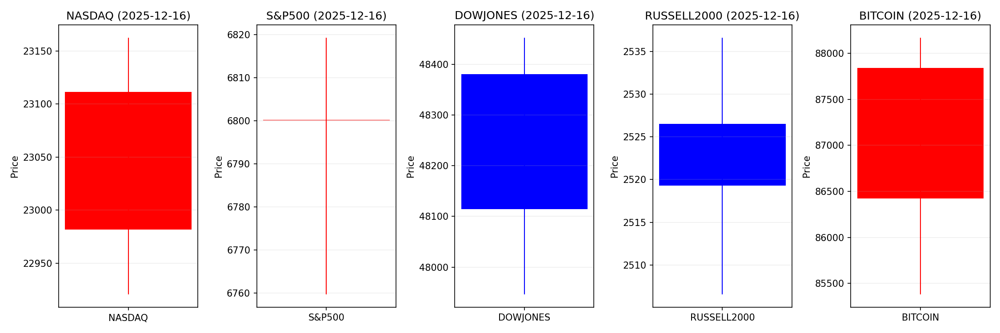
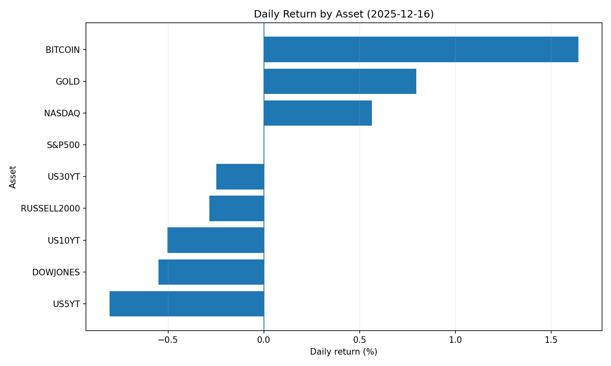
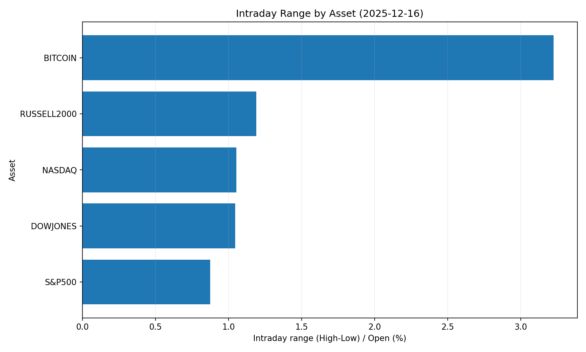
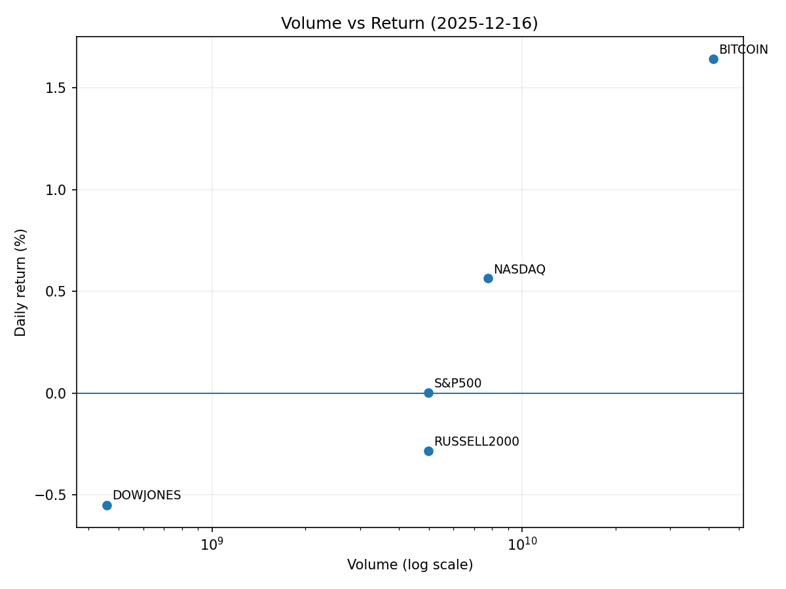

# Market Overview
| stock            | date       |      Open |      High |       Low |     Close |         Volume |   ret_pct |   range_pct |   close_over_open |   candle_dir |
|:-----------------|:-----------|----------:|----------:|----------:|----------:|---------------:|----------:|------------:|------------------:|-------------:|
| NASDAQ           | 2025-12-16 | 22981.8   | 23162.6   | 22920.7   | 23111.5   |    7.75996e+09 |  0.564101 |    1.05274  |          1.00564  |            1 |
| S&P500           | 2025-12-16 |  6800.12  |  6819.27  |  6759.74  |  6800.26  |    4.98318e+09 |  0.002054 |    0.875423 |          1.00002  |            1 |
| DOWJONES         | 2025-12-16 | 48380.2   | 48452.2   | 47946.2   | 48114.3   |    4.574e+08   | -0.549626 |    1.04572  |          0.994504 |           -1 |
| RUSSELL2000      | 2025-12-16 |  2526.5   |  2536.62  |  2506.55  |  2519.3   |    4.98318e+09 | -0.284977 |    1.19019  |          0.99715  |           -1 |
| USD/KRW          | 2025-12-16 |  1467.48  |  1477.04  |  1467.25  |  1467.48  |    0           |  0        |    0.667133 |          1        |            0 |
| Dallor Index/USD | 2025-12-16 |    98.27  |    98.32  |    97.87  |    98.15  |    0           | -0.122108 |    0.457919 |          0.998779 |           -1 |
| GOLD             | 2025-12-16 |  4270.5   |  4321.4   |  4270.5   |  4304.5   | 1796           |  0.79616  |    1.1919   |          1.00796  |            1 |
| BITCOIN          | 2025-12-16 | 86424.4   | 88170.1   | 85381.7   | 87844     |    4.12622e+10 |  1.64257  |    3.22641  |          1.01643  |            1 |
| US5YT            | 2025-12-16 |     3.723 |     3.738 |     3.681 |     3.693 |    0           | -0.805801 |    1.53102  |          0.991942 |           -1 |
| US10YT           | 2025-12-16 |     4.17  |     4.196 |     4.143 |     4.149 |    0           | -0.503595 |    1.27098  |          0.994964 |           -1 |
| US30YT           | 2025-12-16 |     4.836 |     4.871 |     4.821 |     4.824 |    0           | -0.248141 |    1.03391  |          0.997519 |           -1 |

# 2025-12-16 주식 및 경제 리포트 핵심 요약  

## 1. 오늘의 핵심 이슈  

### ① **방위산업 성장 가속화**  
- **플래닛 랩스(Planet Labs)**가 미 정부로부터 2,600만 달러 규모 방위 계약 수주. 위성 감시·정찰 수요 확대로 주가 350% 급등.  
- 미국의 우주·안보 분야 예산 증액과 민관 협력 기술 혁신(위성·AI 연계)이 방위산업의 신성장 동력으로 부상.  

### ② **고려아연 美 합작사 법적 분쟁**  
- 미국 내 제련소 건설을 위한 합작법인(JV) 운영 방식(의결권 독립성)을 둘러싼 **영풍·MBK와 법적 공방** 심화.  
- 미 국방부 주도의 JV 경영권 분리 구조(고려아연 지분 10% 미만)가 전략물자 공급망 리스크 관리에 초점.  

### ③ **원/달러 환율 고공 행진**  
- 원화 환율이 **1,477원** 돌파, 3거래일 연속 강세.  
- **서학개미(해외 주식 투자 개미)의 달러 수요 증가**와 중국 경기 침체 우려가 주요 원인. 한국은행은 외환스와프 연장 등 시장 안정화 조치 추진.  

---

## 2. 시장 동향 요약  

### [산업별 흐름]  
- **방위·항공우주**:  
  - 정부 계약 확대에 따른 중소형 방위기업 수혜. **L3해리스·노스롭 그루먼** 등 주목.  
  - 우주 기반 감시체계(Planet Labs)와 AI 융합 기술 확대.  
- **비철금속**:  
  - 고려아연 분쟁으로 아연 공급망 불확실성 ↑ → **글로벀 아연 가격 변동성** 예상.  
  - 美 내 희토류·티타늄 등 전략자원 수요 확대.  
- **기술(AI)·반도체**:  
  - **미크론 실적 발표** 앞두고 AI 테마주 조정세. 버블 논란에 따른 **나스닥 변동성** 확대.  
  - 24시간 거래 도입(2024.9 예정)으로 글로벌 유동성 유입 기대.  
- **환율 민감 섹터**:  
  - **수출주(삼양식품 등) 호조** vs. **내수주(오뚜기) 부진**.  
  - 아시아 통화(원·루피·위안화) 약세 → 미 수출기업 경쟁력 상승.  

### [특이사항]  
- **미 국채 금리 상승 압력**:  
  - 방위 예산 확대 → 재정 적자 심화 → 장기물 금리 ↑ 우려.  
- **신흥국 자본 이탈**:  
  - 인도 루피 사상 최약세, 외국인 20억 달러 순매도 → **달러 수요 증가** → USD 강세 지속.  
- **안전자산 수요 ↑**:  
  - 글로벌 리스크 오프로 **美 국채·금** 수요 증가 → 금리 하락·금가격 지지.  

---

## 3. 투자 시사점  

### 🇺🇸 **전략 산업 집중 모니터링**  
- **방위·우주·AI**:  
  - 정부 계약 수주 가능성이 높은 **소형 위성·감시 플랫폼 기업** 포트폴리오 편입.  
  - 우주 인프라(Planet Labs)·AI 연계 보안(팔란티어) 테마 주목.  
- **전략물자 공급망**:  
  - 美 내 희토류·아연 생산 확대 추세에 따른 **광산·제련 기업** (MP Materials·Glencore) 수혜.  

### 💹 **환율 리스크 관리**  
- **원화 약세 장기화**:  
  - 수출주(반도체·철강) 편향 전략 vs. 내수주 헤징.  
  - 환헤징 수단(선물·옵션) 활용 필수.  
- **달러 강세 활용**:  
  - USD 현금 보유·달러 표시 자산(미 국채·S&P 500 ETF) 비중 확대.  

### ⚠️ **변동성 대응 전략**  
- **테크주 조정 리스크**:  
  - AI·반도체 과열 종목 일시 감량. 실적 호조 기업(NVIDIA·TSMC)으로 편입.  
  - 나스닥 24시간 거래 도입에 따른 **야간 시간대 변동성** 대비.  
- **법적 분쟁 리스크**:  
  - 해외 JV 추진 기업의 **지배구조·규제 승인 여부** 사전 점검 (CFIUS 검토 가능성).  

### 🌍 **글로벌 자산 배분**  
- **신흥국 위험 회피**:  
  - 자본 이탈 심화국(인도·한국) → **미국·유럽 안전자산** 재배분.  
- **원자재 편입 시기**:  
  - 아연·구리 등 산업재: 공급망 리스크로 단기 상승 가능성 ↑  
  - 금: 달러 강세에 일시 약세, 그러나 안전자산 수요로 1,900달러 선 방어.  

--- 

> **📌 핵심 메시지**:  
> - **방위·우주·전략물자**는 美 재정 지출 확대에 따른 2026년 틈새 성장 테마.  
> - **원/달러 1,500원 돌파** 가능성에 대비한 환율 헤징 및 수출주 재편 필수.  
> - **AI 버블 우려**와 법적 분쟁 리스크 확대 시 **현금 비중 확대**로 유동성 관리.
