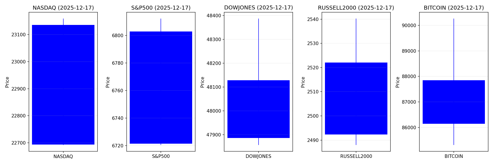
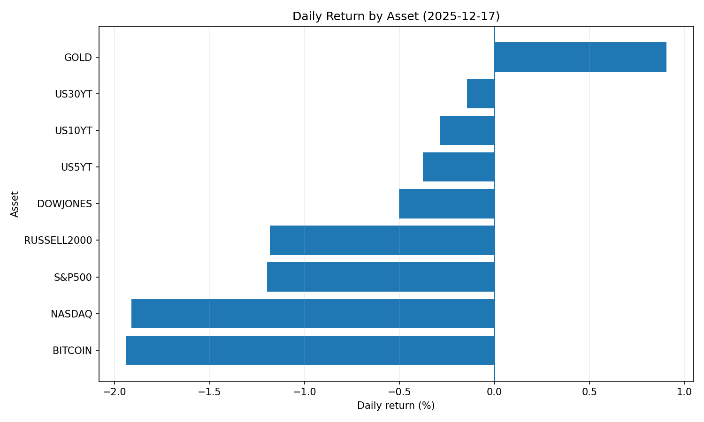
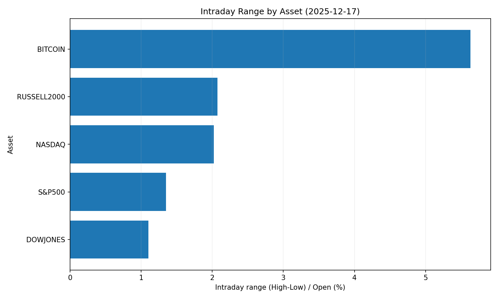
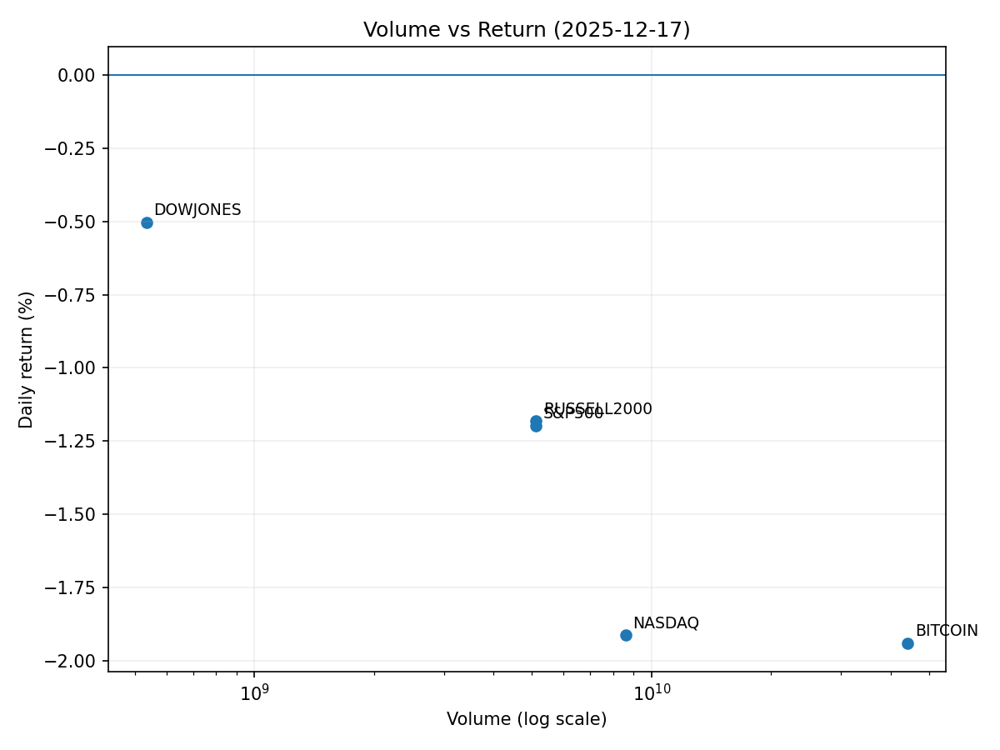

# Market Overview
| stock            | date       |      Open |      High |       Low |     Close |         Volume |   ret_pct |   range_pct |   close_over_open |   candle_dir |
|:-----------------|:-----------|----------:|----------:|----------:|----------:|---------------:|----------:|------------:|------------------:|-------------:|
| NASDAQ           | 2025-12-17 | 23135.6   | 23159.2   | 22692     | 22693.3   |    8.61614e+09 | -1.91172  |    2.01939  |          0.980883 |           -1 |
| S&P500           | 2025-12-17 |  6802.88  |  6812.26  |  6720.43  |  6721.43  |    5.12212e+09 | -1.19728  |    1.34986  |          0.988027 |           -1 |
| DOWJONES         | 2025-12-17 | 48128.1   | 48387.3   | 47856.8   | 47886     |    5.3426e+08  | -0.502996 |    1.10235  |          0.99497  |           -1 |
| RUSSELL2000      | 2025-12-17 |  2522.11  |  2540.25  |  2487.98  |  2492.3   |    5.12212e+09 | -1.18195  |    2.07247  |          0.988181 |           -1 |
| USD/KRW          | 2025-12-17 |  1471.73  |  1481.79  |  1470.41  |  1471.74  |    0           |  0.00068  |    0.77324  |          1.00001  |            1 |
| Dallor Index/USD | 2025-12-17 |    98.21  |    98.64  |    98.18  |    98.37  |    0           |  0.16292  |    0.468383 |          1.00163  |            1 |
| GOLD             | 2025-12-17 |  4308.5   |  4351.4   |  4308.5   |  4347.5   | 2169           |  0.905187 |    0.995704 |          1.00905  |            1 |
| BITCOIN          | 2025-12-17 | 87847.6   | 90264.6   | 85316.3   | 86143.8   |    4.42434e+10 | -1.93956  |    5.63283  |          0.980604 |           -1 |
| US5YT            | 2025-12-17 |     3.709 |     3.716 |     3.693 |     3.695 |    0           | -0.377465 |    0.620113 |          0.996225 |           -1 |
| US10YT           | 2025-12-17 |     4.163 |     4.17  |     4.143 |     4.151 |    0           | -0.288256 |    0.64857  |          0.997117 |           -1 |
| US30YT           | 2025-12-17 |     4.835 |     4.843 |     4.813 |     4.828 |    0           | -0.144777 |    0.62047  |          0.998552 |           -1 |

# 2025-12-17 투자 리포트 핵심 요약

## 1. 오늘의 핵심 이슈
### ① 미디어 산업 대규모 M&A 거절 계약
- **워너브라더스 디스커버리(WBD)**가 파라마운트 스카이댄스의 1,130억 달러 인수 제안 거절  
- **넷플릭스**의 830억 달러 제안 수락 → **주주 권한 강화** 및 적대적 M&A 시장 경쟁 심화 시사  
- 시사점: 미디어 플랫폼 재편 가속화, 반독점 규제 리스크 대두  

### ② 테슬라 주가 사상 최고가 경신
- **489.88달러** 기록 (1년 만에 급등)  
- **스페이스X 상장 기대감** → 일론 머스크의 트위터(X) 인수 부담 감소 전망  
- 시사점: EV/테크주 중심 테마 랠리 지속 가능성  

### ③ AI 인프라 경쟁 격화  
- **오픈AI**, 아마존으로부터 100억 달러 투자 유치 협상 중  
- **AMD** 전략적 파트너십 강화 → AI 생태계 주도권 경쟁 심화  
- 시사점: 클라우드/반도체 산업 성장 동력 확대  

---

## 2. 시장 동향 요약
### 주요 섹터별 흐름
| 섹터         | 동향                                                                 | 배경                                                                 |
|--------------|----------------------------------------------------------------------|----------------------------------------------------------------------|
| **미디어**   | 대형 M&A 경쟁 심화 (WBD, 넷플릭스, 파라마운트)                       | 시장 주도권 장악 경쟁                                               |
| **테크/AI**  | 테슬라·AI 밸류체인(AMD, 아마존) 강세                                 | 스페이스X 상장 기대감, AI 인프라 투자 확대                          |
| **에너지**   | 할리버튼·옥시덴탈 등 약세                                           | WTI 원유가 2021년 이후 최저 (공급 과잉 우려)                        |
| **암호화폐** | 메타플래닛·MSTR 변동성 확대                                          | 비트코인 8만→8.5만 달러 급락 및 100주선 테스트                      |
| **방어주**   | 금 90만원/돌파 (순금 1돈)                                            | 안전자산 수요 증가 (금리 인하 기대 + 리스크 오프)                   |

### 글로벌 특이사항
- **원화 약세 장기화**: 원-달러 **1480원 돌파** (외국인 주식 순매도 + 달러 강세 영향)  
- **신흥국 자본 유출**: 인도 주식 약세 (19.2억 달러 외국인 순매도), 루피 약세 심화  
- **국민연금 국내 편향 논란**: 해외 투자 축소 가능성 → 美 주식/채권 매도 압력 우려  

---

## 3. 투자 시사점
### 📈 주목 포인트
1. **AI/클라우드 인프라 테마**  
   - AMD, 아마존 등 AI 밸류체인 종목 편입 고려  
   - 반도체 장비·데이터센터 관련 기업 수혜 예상  

2. **미디어 업종 리스크 관리**  
   - 넷플릭스/WBD 단기 변동성 대비 → M&A 규제 동향 모니터링 필수  
   - 파라마운트 등 거절 당사자 주가 회복력 점검  

3. **통화정책 대응 전략**  
   - 달러 강세 지속 예상 → 원화/엔 등 아시아 통화 헤징 강화  
   - 연준 의장 인선 불확실성 → 장기채 보다 단기채 편입 우선  

4. **안전자산 재편 필요성**  
   - 금·미 국채 비중 상향 (환율 변동성 확대 및 경기 불확실성 고려)  
   - 방어적 섹터(필수소비재, 유틸리티) 편입 검토  

5. **글로벌 금융 리스크**  
   - 비트코인 100주선 붕괴 시 MSTR 등 암호화폐 테마주 매도 유발 우려  
   - 신흥국 채권 자본 이탈 가능성 → 신용 스프레드 점검  

### ⚠️ 주요 리스크 요인
- **미 연준 금리정책 급변**: 연준 차기 의장 인선 갈등 시장 혼란 유발 가능  
- **중국 경기 부진 확대**: 철강·석유 등 산업재 수요 위축 우려  
- **달러 강세 장기화**: 신흥국 통화 약세 → 원자재 가격 하방 압력  

> ✅ **투자 전략 핵심**:  
> **단기** – 테크/AI 테마 편승 + 통화 헤징 강화  
> **중장기** – 방어자산(금, 단기채) 비중 조정 + 글로벌 공급망 다변화
