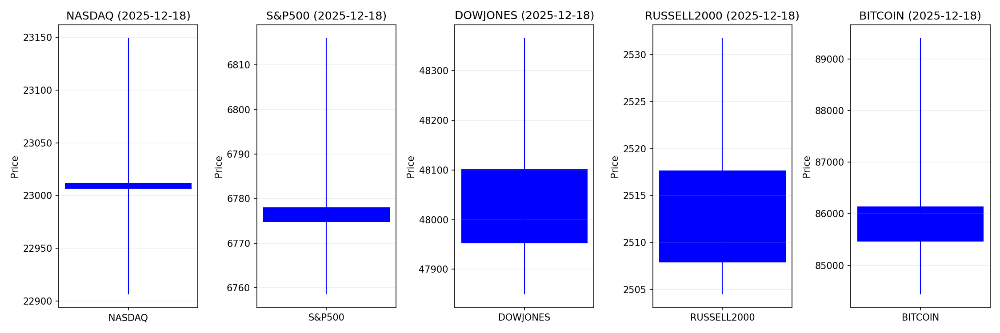
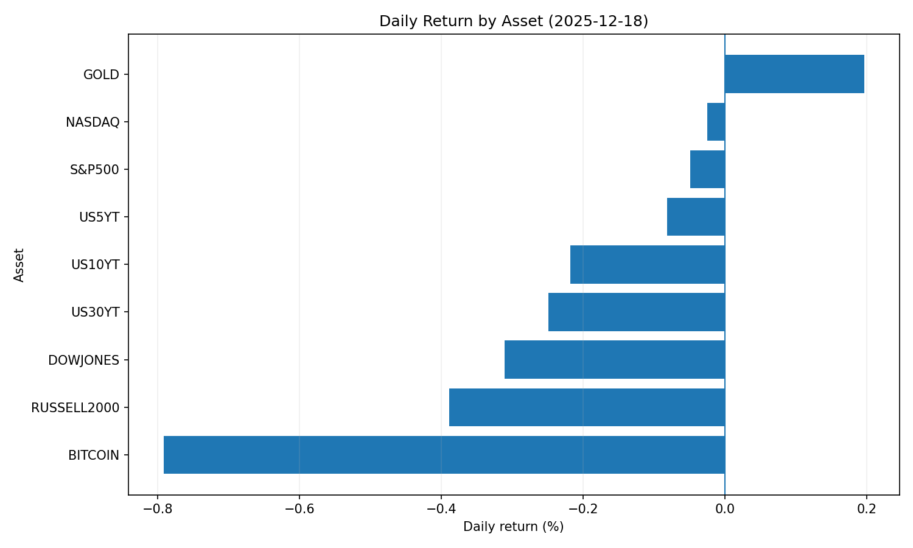
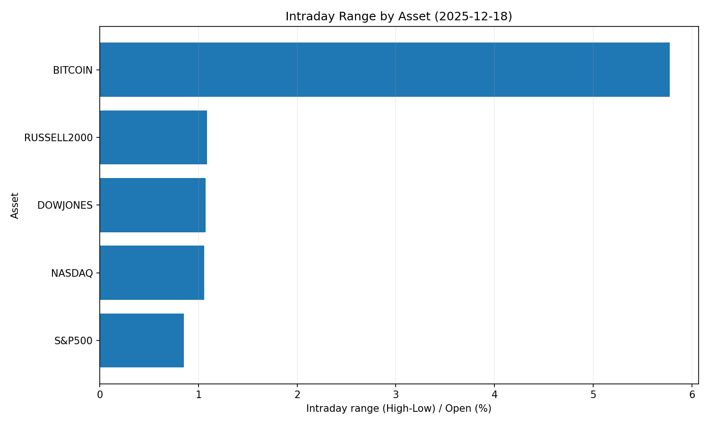
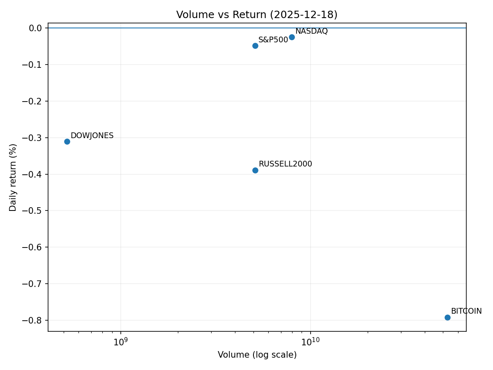

# Market Overview
| stock            | date       |      Open |      High |       Low |     Close |        Volume |   ret_pct |   range_pct |   close_over_open |   candle_dir |
|:-----------------|:-----------|----------:|----------:|----------:|----------:|--------------:|----------:|------------:|------------------:|-------------:|
| NASDAQ           | 2025-12-18 | 23012.1   | 23149.6   | 22906.2   | 23006.4   |   7.97792e+09 | -0.024775 |    1.05761  |          0.999752 |           -1 |
| S&P500           | 2025-12-18 |  6778.06  |  6816.13  |  6758.5   |  6774.76  |   5.10119e+09 | -0.048691 |    0.850242 |          0.999513 |           -1 |
| DOWJONES         | 2025-12-18 | 48101.2   | 48365.9   | 47849.5   | 47951.9   |   5.2143e+08  | -0.310446 |    1.07367  |          0.996896 |           -1 |
| RUSSELL2000      | 2025-12-18 |  2517.66  |  2531.79  |  2504.49  |  2507.87  |   5.10119e+09 | -0.388845 |    1.08434  |          0.996112 |           -1 |
| USD/KRW          | 2025-12-18 |  1476.15  |  1479.54  |  1471     |  1474     |   0           | -0.145651 |    0.578535 |          0.998543 |           -1 |
| Dallor Index/USD | 2025-12-18 |    98.38  |    98.56  |    98.17  |    98.43  |   0           |  0.050826 |    0.396421 |          1.00051  |            1 |
| GOLD             | 2025-12-18 |  4331     |  4348.1   |  4328.2   |  4339.5   | 705           |  0.19626  |    0.459476 |          1.00196  |            1 |
| BITCOIN          | 2025-12-18 | 86144.4   | 89412.7   | 84436.3   | 85462.5   |   5.26671e+10 | -0.791531 |    5.77676  |          0.992085 |           -1 |
| US5YT            | 2025-12-18 |     3.663 |     3.682 |     3.641 |     3.66  |   0           | -0.081901 |    1.1193   |          0.999181 |           -1 |
| US10YT           | 2025-12-18 |     4.125 |     4.137 |     4.108 |     4.116 |   0           | -0.218178 |    0.703037 |          0.997818 |           -1 |
| US30YT           | 2025-12-18 |     4.811 |     4.826 |     4.787 |     4.799 |   0           | -0.24943  |    0.810643 |          0.997506 |           -1 |











```markdown
# 2025-12-18 투자 리포트 핵심 요약

---

## 1. 오늘의 핵심 이슈
### CPI 하락으로 금리 인하 기대 확대
- **미국 11월 CPI** 2.7%로 예상치 하회, 인플레이션 둔화 신호 강화  
- 연준의 2025년 초 **금리 인하 가능성** 시장 반영 중 (→ 주식 시장 유동성 기대↑)  
- 달러 약세·미 국채 수요 회복·원자재 가격 안정화 전망  

### 스테이블코인·암호화폐의 달러 패권 영향력 증대
- 마이클 세일러: "스테이블코인 확산은 달러 기축통화 지위 강화"  
- 비트코인은 **디지털 자산**으로 금·부동산과 경쟁하는 가치 저장 수단 대두  
- 장기적 금융 시스템 변화 예고 → 미 증시 유동성 재편 리스크  

### 반도체 산업 동향의 양극화  
- **마이크론** 136억 달러 매출 전망치 상향 (AI·HPC 수요↑) vs **오라클** AI 데이터센터 발표로 회의론 확산  
- 반도체 주력국(美·韓) 시장 변동성 증대, AI 테마주 분화 심화 예상  

---

## 2. 시장 동향 요약
### 📈 주요 섹터별 동향  
| 섹터             | 현황                                      | 주요 변동 요인                     |
|------------------|-------------------------------------------|-----------------------------------|
| **기술(반도체)**  | ➕ 메모리 반도체 강세 ➖ AI 인프라 조정     | 마이크론 실적·오라클 회의론        |
| **소비재**        | 소비 심리 회복 기대 ↑                     | 인플레이션 둔화·연말 할인 효과     |
| **금융**         | 고금리 수혜 ➔ 금리 인하 전망에 하방 압력 | 연준 통화 정책 기대 전환          |
| **에너지**       | 원유 가격 안정화 ➔ 성장 회복 기대 반영    | 인플레이션 완화·수요 전망 개선     |

### 🌐 글로벌 자산 동향  
- **주식**: 美 기술주 중심 상승세 지속 (유동성 기대) vs 경기 민감주 약세  
- **채권**: CPI 둔화로 **장기채 금리 ↓**, 단 공급 증가 압력 상존  
- **환율**: 달러 약세 전망 (아시아 통화 대비 원화 추가 약세 리스크)  
- **원자재**: 금(↑ 인플레이션 헤지) vs 산업재(↓ 달러 강세·중국 수요 우려)  

---

## 3. 투자 시사점  
### 🔍 전략적 포커스
- **통화 정책 전환 대응**:  
  - 2025년 초반 **금리 인하 기대**에 테크·소비재 섹터 편중  
  - 달러 약세 노출 資産(신흥국 주식·원자재) 비중 확대 검토  
- **산업별 분화 활용**:  
  - 美 반도체·AI 인프라株 분화 심화 → **메모리 반도체** 중심 포지셔닝  
  - 中 GPU 기업(메타엑스) 급등 등 **글로벌 AI 2진급 테마** 모니터링  
- **지역별 리스크 관리**:  
  - 아시아 통화 변동성(원·엔) 확대 ➔ **환율 헤지 수단** 병행 필수  
  - 韓 국내 증시 외국인 유입 정책(→ KOSPI 지원력) vs 美 증시 자금 이탈 우려  

### 💼 유의할 리스크 요인
1. **정치적 불확실성**: 트럼프 정부 레임덕 국면→통상 갈등·관세 리스크  
2. **엔 캐리 트레이드 청산**: 일본 금리 인상 시 글로벌 자본 이동 쇼크  
3. **AI 버블 경고**: 기술주 과열 평가 조정 가능성 대비  

> 📌 **핵심 Action Point**:  
> - CPI 둔화에 따른 **유동성 테마주(빅테크·소비재)** 편입  
> - AI·반도체 內 **메모리 반도체** vs **AI 인프라주** 분화 전략 수립  
> - 아시아 통화 약세 대비 **달러 헤지 비중 확대** 및 금(金) 편입 검토
```
