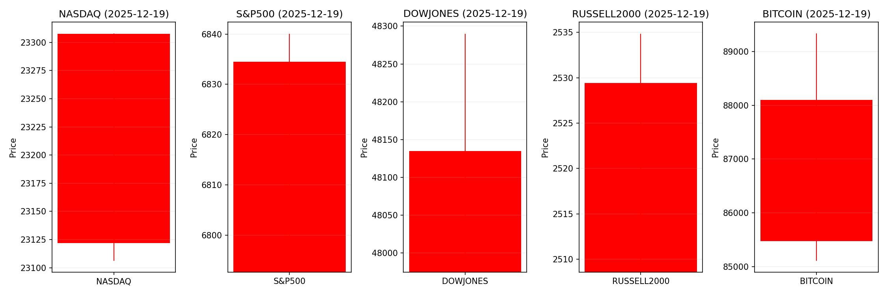
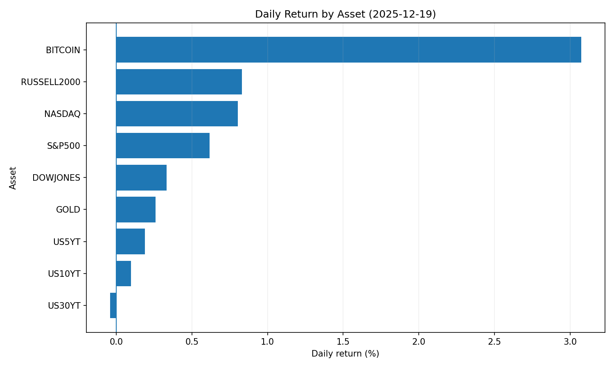
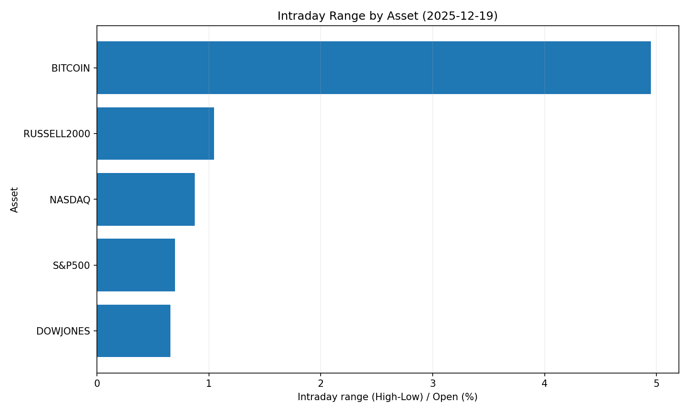
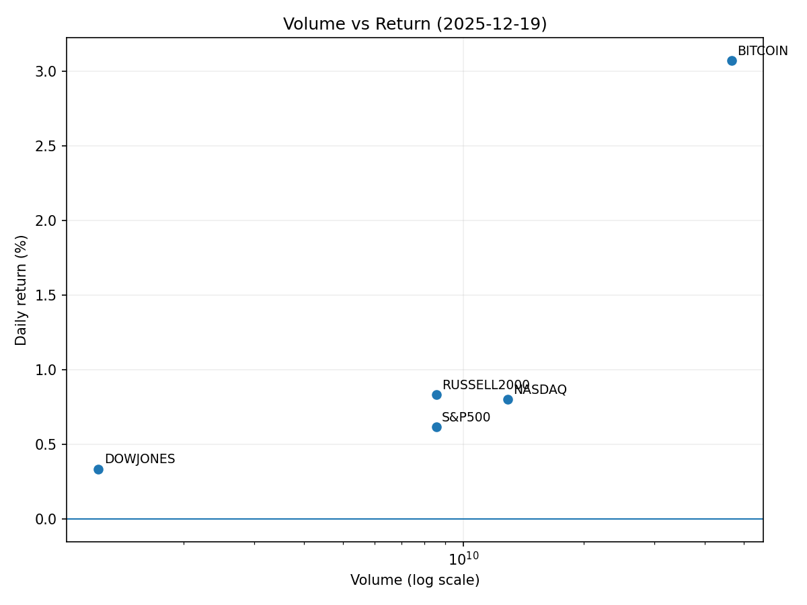

# Market Overview
| stock            | date       |      Open |      High |       Low |     Close |         Volume |   ret_pct |   range_pct |   close_over_open |   candle_dir |
|:-----------------|:-----------|----------:|----------:|----------:|----------:|---------------:|----------:|------------:|------------------:|-------------:|
| NASDAQ           | 2025-12-19 | 23121.9   | 23307.9   | 23106.2   | 23307.6   |    1.28746e+10 |  0.803216 |    0.872423 |          1.00803  |            1 |
| S&P500           | 2025-12-19 |  6792.62  |  6840.02  |  6792.62  |  6834.5   |    8.55447e+09 |  0.61655  |    0.697815 |          1.00616  |            1 |
| DOWJONES         | 2025-12-19 | 47974.8   | 48289.6   | 47974.8   | 48134.9   |    1.22752e+09 |  0.333655 |    0.656195 |          1.00334  |            1 |
| RUSSELL2000      | 2025-12-19 |  2508.59  |  2534.82  |  2508.59  |  2529.43  |    8.55447e+09 |  0.830739 |    1.04561  |          1.00831  |            1 |
| USD/KRW          | 2025-12-19 |  1475.09  |  1479.15  |  1473.69  |  1474.36  |    0           | -0.049487 |    0.370153 |          0.999505 |           -1 |
| Dallor Index/USD | 2025-12-19 |    98.46  |    98.75  |    98.42  |    98.6   |    0           |  0.142189 |    0.335163 |          1.00142  |            1 |
| GOLD             | 2025-12-19 |  4350.1   |  4361.4   |  4350.1   |  4361.4   | 1065           |  0.25976  |    0.25976  |          1.0026   |            1 |
| BITCOIN          | 2025-12-19 | 85476.1   | 89339.1   | 85107.7   | 88103.4   |    4.67333e+10 |  3.07367  |    4.95045  |          1.03074  |            1 |
| US5YT            | 2025-12-19 |     3.686 |     3.7   |     3.676 |     3.693 |    0           |  0.189907 |    0.65111  |          1.0019   |            1 |
| US10YT           | 2025-12-19 |     4.147 |     4.157 |     4.13  |     4.151 |    0           |  0.09646  |    0.651072 |          1.00097  |            1 |
| US30YT           | 2025-12-19 |     4.83  |     4.832 |     4.808 |     4.828 |    0           | -0.041405 |    0.496888 |          0.999586 |           -1 |

# 2025-12-19 투자 리포트 요약

## 1. 오늘의 핵심 이슈
**① 미 증시 변동성 확대**  
- 트리플 위칭데이(파생상품 만기일) 및 BOJ 금리 정책 기대 속 장초반 상승 → 외국인 순매도·AI 주 조정으로 변동성 확대  
- 한국 보관 미국주 보유액 7.6조 원 급감, 고용지표 발표 경계 반영  

**② 해외주식 수수료 규제 강화**  
- 한국 금감원, 증권사 12곳 현장검사(수수료 과다징출·투자자 보호 미흡 적발)  
- 상위 증권사 마케팅 캠페인 중단, 연간 2조 원 규모 시장 영향 전망  

**③ 기업 디지털 자산 투자 확대**  
- Mangoceuticals, 솔라나(SOL) 중심으로 1억 달러 규모 투자 계획 발표  
- ATM 프로그램·주식 매각 통한 자금 조달 → 주가 희석 리스크 동반  

---

## 2. 시장 동향 요약
### 주식 시장  
- **AI/테크주**: 단기 조정 우려 있으나 실적 호조 기반 안정화 전망  
- **소비재**: 나이키 대량 매도 사례 반영, 기관 투자자 신뢰도 하락  
- **암호화폐 관련주**: 기관 투자 확대(BitMine 2.2억 달러 ETH 매입)로 강세  

### 채권 시장  
- **미 국채**: BOJ 금리 인상으로 일본 투자자 매수 여력 감소 → 금리 상승 압력  
- **신흥국 채권**: 엔 캐리 트레이드 청산 우려로 자본 유출 가속화  

### 외환 및 원자재  
- **USD/JPY**: 엔화 약세 지속(160 돌파 가능성) → 아시아 통화 변동성 확대  
- **금**: 시장 불확실성으로 수요 증가, 비트코인은 고점 대비 30% 조정  
- **산업재 원자재**: 달러 강세·경기 둔화로 하방 압력  

---

## 3. 투자 시사점
**① 정책 리스크 모니터링**  
- **Fed·BOJ 금리 정책**: 일본 금리 인상(0.75%)이 글로벌 유동성에 미칠 영향 분석 필수  
- **한국 규제**: 해외주식 수수료 인상 → 소매 투자자 미주식 매수 감소(테슬라·반도체株 영향)  

**② 포트폴리오 전략**  
- **단기 변동성 대비**: 고금리 적금·외화예치 상품('외화지준 부리')으로 자금 일부 전환 고려  
- **장기 성장 테마**: AI 인프라·암호화폐(특히 SOL 등 알트코인) 및 우주산업(스페이스X 상장 기대) 집중  

**③ 글로벌 자산 배분**  
- **엔화 노출 축소**: BOJ 금리 인상에 따른 JPY/USD 변동성 대비  
- **한국 국채**: 2025년 WGBI 편입 기대 → 외국인 유입 증가 시 기회 선점  

> **핵심 액션포인트**:  
> - 변동성 완화를 위해 실적 견고한 대형 테크주 우선 편입  
> - 일본 국채 금리 상승 → 미 국채 매수 타이밍 주시  
> - 원화 약세 심화 시 달러 헤징 수단(선물·ETF) 활용 검토  

--- 

**리포트 작성일**: 2025-12-20  
**출처**: 글로벌 거시경제 데일리 리포트
