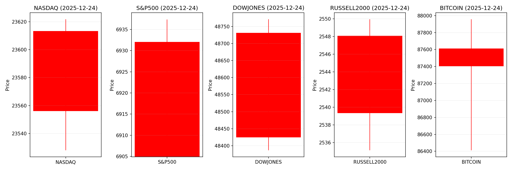
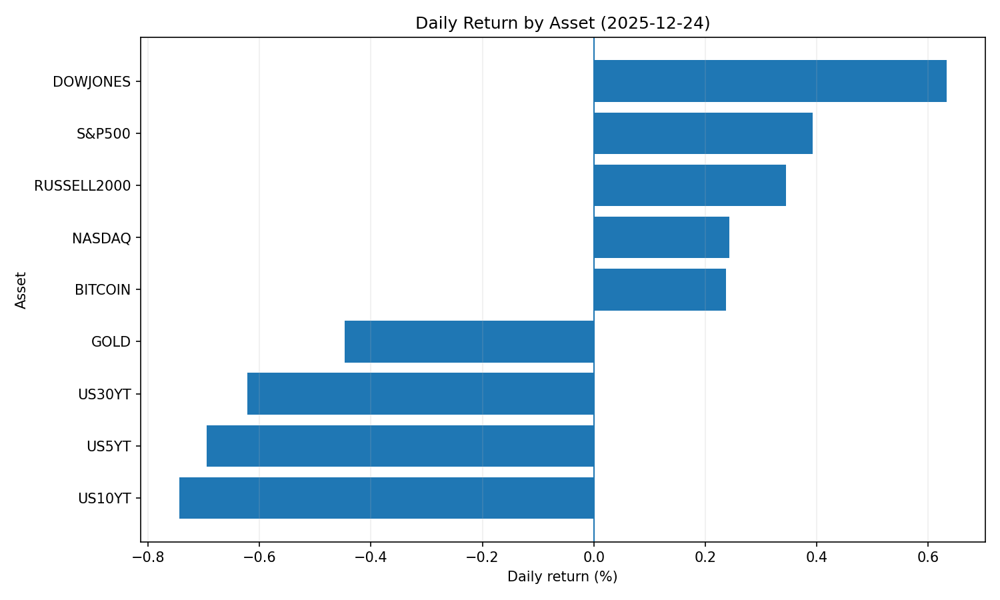
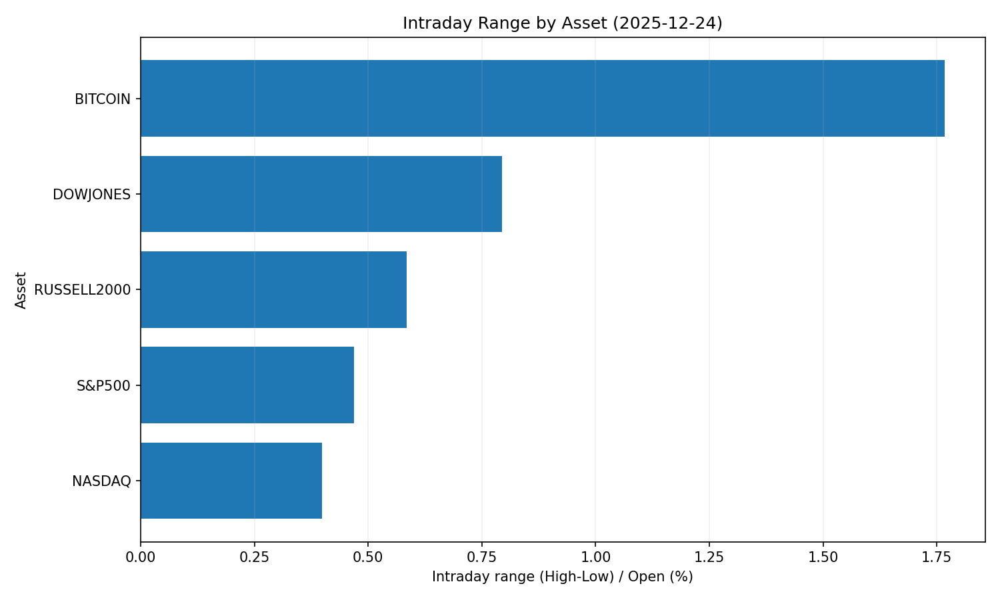
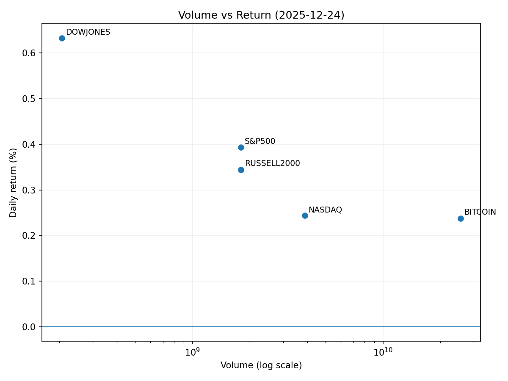

# Market Overview
| stock            | date       |      Open |      High |       Low |     Close |        Volume |   ret_pct |   range_pct |   close_over_open |   candle_dir |
|:-----------------|:-----------|----------:|----------:|----------:|----------:|--------------:|----------:|------------:|------------------:|-------------:|
| NASDAQ           | 2025-12-24 | 23555.9   | 23621.7   | 23528     | 23613.3   |   3.88519e+09 |  0.243511 |    0.397989 |          1.00243  |            1 |
| S&P500           | 2025-12-24 |  6904.91  |  6937.32  |  6904.91  |  6932.05  |   1.79827e+09 |  0.393049 |    0.469371 |          1.00393  |            1 |
| DOWJONES         | 2025-12-24 | 48424.7   | 48771.3   | 48386.6   | 48731.2   |   2.0674e+08  |  0.632836 |    0.794492 |          1.00633  |            1 |
| RUSSELL2000      | 2025-12-24 |  2539.33  |  2549.96  |  2535.13  |  2548.08  |   1.79827e+09 |  0.344579 |    0.584015 |          1.00345  |            1 |
| USD/KRW          | 2025-12-24 |  1478.67  |  1478.67  |  1429.69  |  1478.67  |   0           |  0        |    3.31244  |          1        |            0 |
| Dallor Index/USD | 2025-12-24 |    97.89  |    98.01  |    97.75  |    97.98  |   0           |  0.091944 |    0.265606 |          1.00092  |            1 |
| GOLD             | 2025-12-24 |  4500.7   |  4503.4   |  4468.4   |  4480.6   | 500           | -0.446599 |    0.777657 |          0.995534 |           -1 |
| BITCOIN          | 2025-12-24 | 87404.3   | 87956.9   | 86411.8   | 87612     |   2.55503e+10 |  0.237563 |    1.76774  |          1.00238  |            1 |
| US5YT            | 2025-12-24 |     3.743 |     3.743 |     3.713 |     3.717 |   0           | -0.694631 |    0.801495 |          0.993054 |           -1 |
| US10YT           | 2025-12-24 |     4.167 |     4.167 |     4.132 |     4.136 |   0           | -0.743932 |    0.839929 |          0.992561 |           -1 |
| US30YT           | 2025-12-24 |     4.828 |     4.829 |     4.791 |     4.798 |   0           | -0.62138  |    0.787078 |          0.993786 |           -1 |

# 2025-12-24 주식 및 경제 리포트 핵심 요약

## 1. 오늘의 핵심 이슈
### ① **미국 시장 '산타 랠리' 지속**
- **경기 회복 신호**: 실업률·고용 지표 호조로 인해 경기침체 우려 완화 → 연말 S&P 500 1.3% 상승 및 나스닥 1.5% 강세  
- **산업별 분화 심화**: 엔비디아(▲2.5%) vs 인텔(▼1.8%) 반도체 업종 내 성장 격차 확대, 소비재 강세(나이키 ▲2.0%)  
- **변동성 리스크**: 크리스마스 시즌 단축 거래일로 유동성 감소, 테슬라 판매 전망 감소(-9%)에 따른 단기 조정 우려  

### ② **한국 금융당국의 해외주식 규제 강화**
- **자발적 마케팅 중단**: 메리츠·키움증권 등 한국 증권사 社 해외주식 수수료 무료행사 및 텔레그램 채널 운영 중단  
- **정책적 배경**: 원/달러 환율(1,450원대) 안정화 목적 → 2025년 47조 원 규모 한국 개인 투자자 자본 유출 제동  
- **글로벌 파급력**: 미국 테마주(테슬라·반도체) 유동성 축소 전망, 아시아 국가들로 규제 트렌드 확산 가능성  

### ③ **글로벌 환율 변동성 확대**  
- **원/달러 3년 최대 급락**: 한국 구두개입으로 33.80원 폭락(1,440원대), 위안화 강세 동반  
- **미 달러 약세 영향**: 수출기업 실적 압력, 신흥국 통화 강세 연쇄 반응  
- **투자자 전략 변화**: 환헤지 수요 증가 및 달러 선물 매도 확대 → 미 국채 수익률 변동성 ↑  

---

## 2. 시장 동향 요약
### 🇺🇸 **미국 중심 시장 흐름**
| **섹터**       | **주요 동향**                                                            | **특이사항**                                     |
|----------------|-------------------------------------------------------------------------|------------------------------------------------|
| **반도체**     | AI 수요 견인(엔비디아 ▲) vs 전통 반도체 부진(인텔 ▼) → 섹터 로테션 가속화           | 미 정부 對中 반도체 관세 유예로 중국 공급망 안정화     |
| **소비재**     | 나이키 대량 매수(+2%)로 연말 소비 심리 긍정적 반영                               | 소매 유통업체 연말 할인전 확대로 경기 확장 신호         |
| **테크/성장주** | 개인 투자자 테마주 집중(엔비디아·테슬라) → ELS 상품 발행 증가(연 10.56% 수익률)       | 한국 ELS 발행 확대로 팔란티어·마이크론 등 수혜 전망    |
| **전기차**     | 테슬라 판매 감소 전망(-9%) → 리튬·니켈 수요 하향 조정 가능성                     | 콕스 오토모티브 전망에 따른 단기 변동성 확대 우려       |

### 🌏 **글로벌 자산 흐름**
- **주식**: 美 대형테크 위주 상승 → 신흥국 자금 유출 압력(한국 코스피 4100선 후퇴)  
- **채권**: 美 장기금리(10년물) 4%대 유지 → 경기 회복 기대에 하락폭 제한적  
- **환율**: 달러 강세 기조 유지(엔·유로 약세) → 원화 급락으로 아시아 통화 불안정성 ↑  
- **원자재**: 산업용 금속(구리) 수요 상승 vs 전기차 소재(리튬) 수요 전망 하향  

---

## 3. 투자 시사점
### 🔍 **주요 모니터링 포인트**
- **산업별 성장 분화**: AI 반도체(엔비디아)·클라우드 vs 전통 반도체(인텔) 간 투자 전략 차별화 필요  
- **규제 리스크**: 한국 등 아시아 국가들의 해외투자 제한 확대 → 美 소형주·테마주 유동성 변동성 ↑  
- **환율 헤징 전략**: 美 달러 강세 지속 시 원화·엔화 약세 대응 포트폴리오 재편 검토  

### 💡 **투자 전략 제안**
1. **섹터 로테션 활용**:  
   - *호재*: 소비재(연말 소비심리 호조) + AI 인프라(팔란티어·마이크론)  
   - *리밸런싱*: 전기차 리튬 공급 과잉 대비 반도체 소재(실리콘) 편입 고려  
2. **글로벌 자산 배분**:  
   - 美 국채(장기물) : 경기 침체 시 헤지 수단  
   - 신흥국 채권 : 원화 강세 기대 활용 Carry Trade  
3. **변동성 관리**:  
   - 단기 : 크리스마스 기간 유동성 감소로 VIX 선물 활용  
   - 중장기 : 규제 강화 대비 ELS 파생상품 헤지 전략  

> 🚨 **리스크 요인**  
> - 한국 개인 투자자 美주식 매도 확대 → 테슬라·빅테크 단기 조정  
> - 일본 국채 금리 인상(3%↑) → 글로벌 채권 수익률 상승 연쇄 효과  
> - 美 GDP 강세 지속 → 金利인하 시점 지연 가능성
