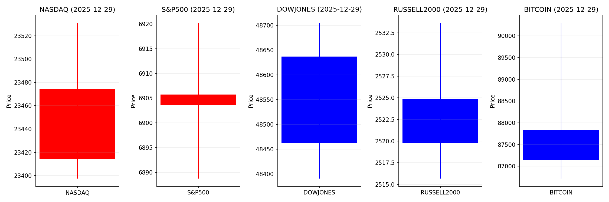
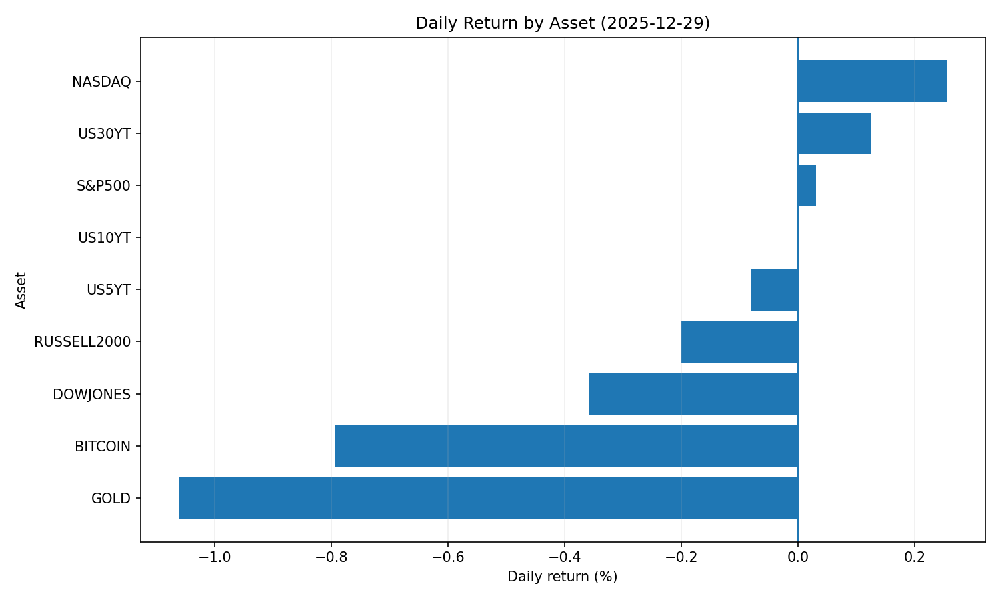
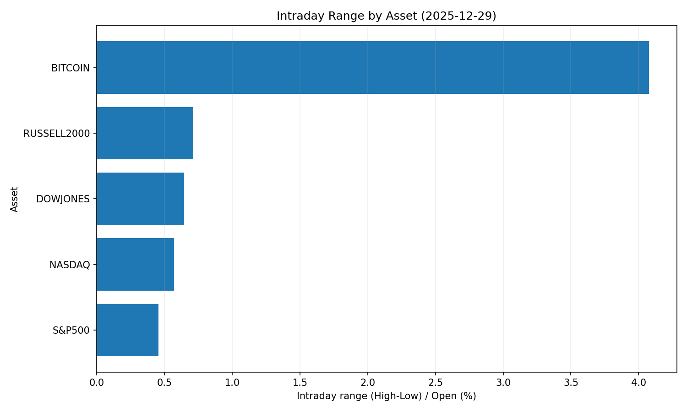
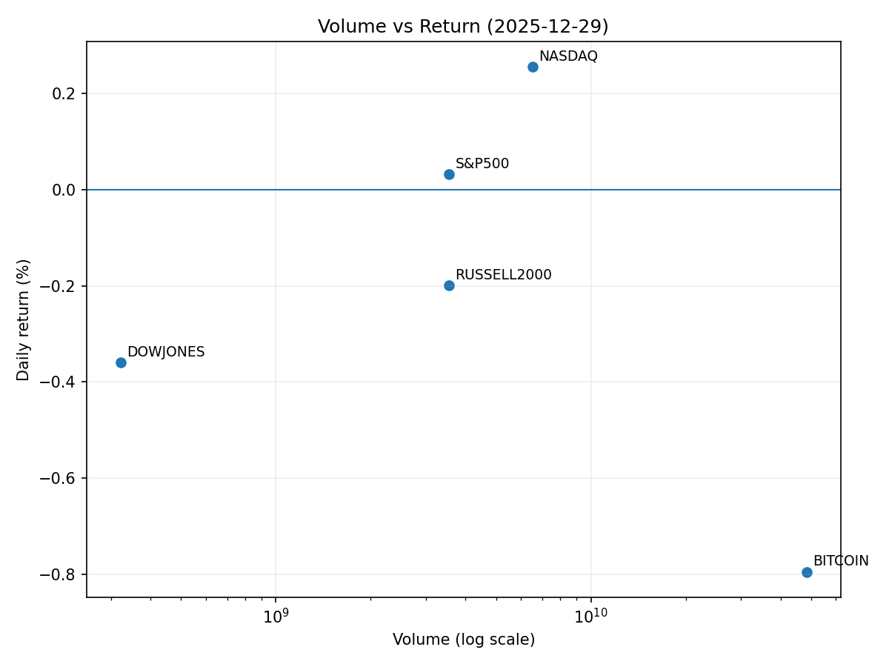

# Market Overview
| stock            | date       |      Open |      High |       Low |     Close |         Volume |   ret_pct |   range_pct |   close_over_open |   candle_dir |
|:-----------------|:-----------|----------:|----------:|----------:|----------:|---------------:|----------:|------------:|------------------:|-------------:|
| NASDAQ           | 2025-12-29 | 23414.7   | 23531     | 23397.5   | 23474.3   |    6.52753e+09 |  0.25484  |    0.570155 |          1.00255  |            1 |
| S&P500           | 2025-12-29 |  6903.6   |  6920.21  |  6888.76  |  6905.74  |    3.54175e+09 |  0.031    |    0.455562 |          1.00031  |            1 |
| DOWJONES         | 2025-12-29 | 48636.6   | 48704.8   | 48390.9   | 48461.9   |    3.2185e+08  | -0.359193 |    0.645435 |          0.996408 |           -1 |
| RUSSELL2000      | 2025-12-29 |  2524.84  |  2533.65  |  2515.68  |  2519.8   |    3.54175e+09 | -0.199618 |    0.711727 |          0.998004 |           -1 |
| USD/KRW          | 2025-12-29 |  1433.9   |  1437.7   |  1429.64  |  1441.33  |    0           |  0.518162 |    0.562099 |          1.00518  |            1 |
| Dallor Index/USD | 2025-12-29 |    98.05  |    98.18  |    97.92  |    98.04  |    0           | -0.010201 |    0.265173 |          0.999898 |           -1 |
| GOLD             | 2025-12-29 |  4371.5   |  4379     |  4325.1   |  4325.1   | 2044           | -1.06142  |    1.23298  |          0.989386 |           -1 |
| BITCOIN          | 2025-12-29 | 87835.8   | 90299.2   | 86717.9   | 87138.1   |    4.84116e+10 | -0.794264 |    4.0772   |          0.992057 |           -1 |
| US5YT            | 2025-12-29 |     3.68  |     3.689 |     3.668 |     3.677 |    0           | -0.081522 |    0.57065  |          0.999185 |           -1 |
| US10YT           | 2025-12-29 |     4.116 |     4.13  |     4.108 |     4.116 |    0           |  0        |    0.534507 |          1        |            0 |
| US30YT           | 2025-12-29 |     4.799 |     4.815 |     4.794 |     4.805 |    0           |  0.125027 |    0.437589 |          1.00125  |            1 |

# 2025-12-29 주식 및 경제 뉴스 리포트 핵심 요약

## 1. 오늘의 핵심 이슈
1. **기술주 약세 및 미 증시 하락**  
   - 뉴욕 증시가 기술주 약세로 전반적 하락세 기록, 특히 다우지수 소폭 하락  
   - 국채 금리 변동성 지속(10년물 4.11%, 2년물 변동) 및 금리 인상 잔여 효과에 대한 경계심 반영  
   
2. **아마존 중심의 성장동력 부각**  
   - 애널리스트·UBS 등 주요 기관 아마존을 2026년 톱 픽 선정 (목표주가 +33%)  
   - AI·클라우드 사업 확장과 식료품 배달 재진출을 핵심 성장 동력으로 평가  

3. **글로벌 주식시장 리더십 변화**  
   - 2023년 유럽(달러 기준 +36%)·일본·신흥국 주식이 S&P500(+19%) 상회  
   - 미국 기술주 집중 성장의 한계성 대두, 산업 다각화 필요성 제기  

---

## 2. 시장 동향 요약
### 주요 섹터별 흐름
| **섹터**         | **추세**                 | **주요 이슈**                                  |
|-------------------|--------------------------|-----------------------------------------------|
| **기술(IT)**     | ➖ 조정 압력             | 평가 조정 가능성 고금리·경기둔화 우려 반영    |
| **헬스케어**      | ➕ 강세 지속 전망        | 릴리 등 글로벌 의약품 수요 증가 기대         |
| **반도체**       | ➕ ETF 급등              | AI·HPC 수요 확대 및 국내 정책 지원 반응      |
| **유통**         | ➖ 재편 압력             | 아마존 서비스 확장에 따른 경쟁 격화          |

### 특이사항
- **외환시장**: 원화 강세 지속 (원/달러 1,420원대) → 아시아 통화 동조화 강세 가능성  
- **암호화폐**: ETF 승인 기대와 규제 리스크 병존 (비트코인 67만 개 기관 보유량 돌파)  
- **글로벌 자금 흐름**: 유럽·일본 주식 우위, 한국 주식 외국인 연속 매수세  

---

## 3. 투자 시사점
### 포커스 3대 포인트
✅ **정책 민감성 관리**  
   - 연준 금리 인하 시기·규모에 대한 시장 기대 재평가 필요 → **단기채권 변동성** 주시  
   - 한국 환율 안정화 정책의 미주시장 파급효과 모니터링 (달러 유동성 감소 리스크)  

✅ **섹터별 기회 발굴**  
   - **테크 대형주**: AI·클라우드 인프라 투자 확대 수혜(아마존·엔비디아)  
   - **밸류에이션 재평가**: 헬스케어(유나이티드헬스)·저평가 소재株 저가매수 기회  
   - **글로벌 다각화**: 유럽·일본 주식 및 반도체 ETF 편입 고려  

⚠️ **리스크 관리**  
   - **정치·규제 변수**: 미중 기술 패쟁·한국 정치 리스크의 시장 변동성 확대 가능성  
   - **기술주 집중 리밸런싱**: 과도한 테크 비중 포트폴리오 조정 필요성 대두  

---

> **전략적 제안**: AI·디지털 인프라 테마의 장기 성장성은 유지되나, 글로벌 경기 신호와 연준 정책 기조에 따라 **2026년 상반기 포트폴리오의 방어적 전환**을 검토할 시점.
