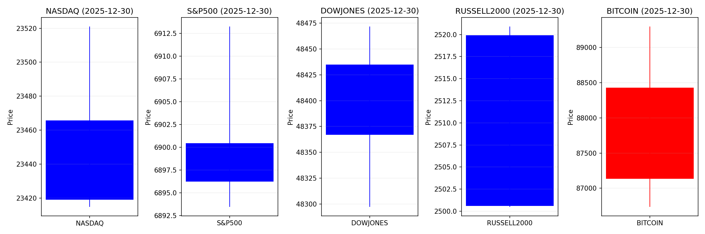
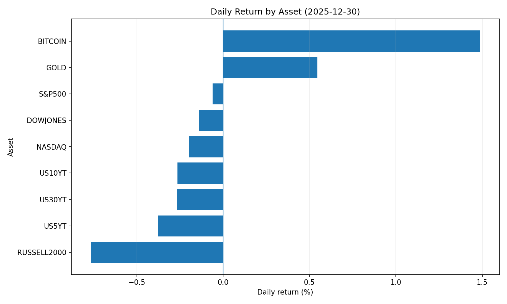
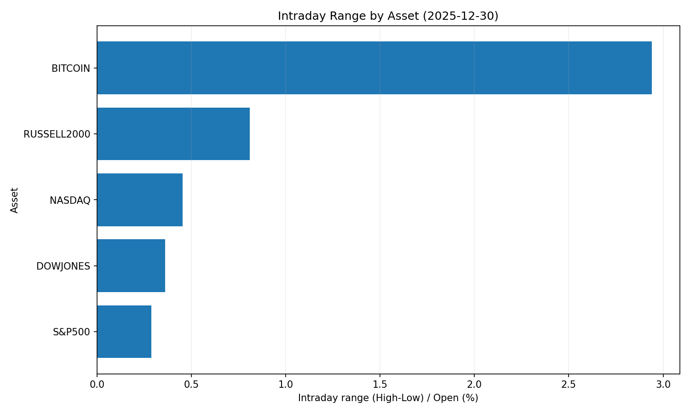
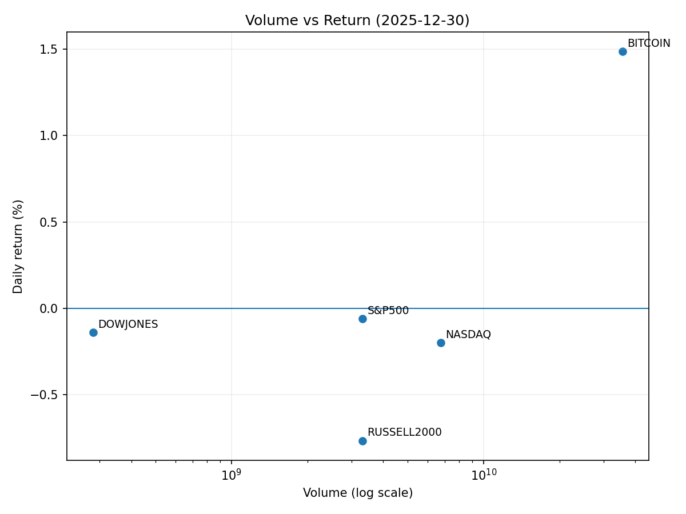

# Market Overview
| stock            | date       |      Open |      High |       Low |     Close |         Volume |   ret_pct |   range_pct |   close_over_open |   candle_dir |
|:-----------------|:-----------|----------:|----------:|----------:|----------:|---------------:|----------:|------------:|------------------:|-------------:|
| NASDAQ           | 2025-12-30 | 23465.7   | 23521.1   | 23414.8   | 23419.1   |    6.7693e+09  | -0.198545 |    0.452664 |          0.998015 |           -1 |
| S&P500           | 2025-12-30 |  6900.44  |  6913.25  |  6893.47  |  6896.24  |    3.30993e+09 | -0.060861 |    0.286645 |          0.999391 |           -1 |
| DOWJONES         | 2025-12-30 | 48434.9   | 48471.7   | 48297.3   | 48367.1   |    2.8257e+08  | -0.140024 |    0.360149 |          0.9986   |           -1 |
| RUSSELL2000      | 2025-12-30 |  2519.9   |  2520.91  |  2500.49  |  2500.59  |    3.30993e+09 | -0.766293 |    0.810347 |          0.992337 |           -1 |
| USD/KRW          | 2025-12-30 |  1430.51  |  1448.63  |  1428.95  |  1434.71  |    0           |  0.293598 |    1.37574  |          1.00294  |            1 |
| Dallor Index/USD | 2025-12-30 |    98.01  |    98.27  |    97.94  |    98.24  |    0           |  0.234666 |    0.336694 |          1.00235  |            1 |
| GOLD             | 2025-12-30 |  4346.4   |  4403.6   |  4338     |  4370.1   | 1837           |  0.545283 |    1.5093   |          1.00545  |            1 |
| BITCOIN          | 2025-12-30 | 87134.4   | 89297.9   | 86735.5   | 88430.1   |    3.55864e+10 |  1.48711  |    2.94074  |          1.01487  |            1 |
| US5YT            | 2025-12-30 |     3.696 |     3.696 |     3.668 |     3.682 |    0           | -0.378793 |    0.757579 |          0.996212 |           -1 |
| US10YT           | 2025-12-30 |     4.141 |     4.141 |     4.116 |     4.13  |    0           | -0.265629 |    0.60371  |          0.997344 |           -1 |
| US30YT           | 2025-12-30 |     4.826 |     4.826 |     4.799 |     4.813 |    0           | -0.269374 |    0.559478 |          0.997306 |           -1 |

아래는 2025년 12월 30일자 리포트를 바탕으로 작성한 **핵심 요약**입니다.

---

# 📈 2025년 12월 30일 시장 분석 요약

## 1. 오늘의 핵심 이슈 (Top 3)

1.  **산타랠리 피로 & FOMC 경계감 속 美증시 조정**
    *   뉴욕증시가 연말 상승에 따른 차익실현 매물과 FOMC 회의록 공개 경계감으로 **조정 국면**에 진입했습니다.
    *   한국 투자자들의 미국 주식 보유액 감소(약 1조 7,350억 원)는 위험자산 회피 심리 확대 및 달러 수요 변화의 전조로 해석됩니다.

2.  **한국 증시의 압도적 성과 vs 美증시 상대적 부진**
    *   2023년 코스피 상승률(75.6%)이 美(17%) 및 주요국을 큰 격차로 앞섬에 따라, **글로벌 자본의 아시아(특히 한국) 쏠림 현상**이 심화되고 있습니다.
    *   이는 원화 강세 요인과 더불어 美 대형주 ETF의 자금 이탈 리스크를 동시에 야기하고 있습니다.

3.  **실물자산(RWA) 토큰화 및 주식형 파생상품 확장 가속**
    *   **주식 기반 파생상품(영구선물)**의 월 거래량이 1조 달러를 돌파했으며, 美 주식/국채의 **RWA(실물자산) 토큰화**가 급속도로 확산 중입니다.
    *   이는 전통 금융과 디파이(DeFi)의 융합을 촉진하며, 달러 유동성 수요 확대와 규제 리스크(SEC)를 동시에 키우고 있습니다.

---

## 2. 시장 동향 요약

### 🇺🇸 미국 주식 & 채권
*   **증시 조정:** 산타랠리 후유증과 차익실현으로 **테크주(NVIDIA 등) 단기 조정** 압력이 높습니다. BDC(비즈니스 개발사) 주가 급락은 중소기업 신용 리스크 부각 요인입니다.
*   **채권:** FOMC 기록 공개 전 **안전자산 수요 소폭 증가**. 단, 연준의 "Higher for Longer" 기조 재확인 시 단기 금리 민감도가 커질 수 있습니다.
*   **헤지 자산:** 비트코인보다 **금(Gold)과 미 국채 수요**가 우위를 보이며, 위험자산보다는 안정성 선호 경향이 강합니다.

### 🌏 한국 및 아시아 시장
*   **KOSPI 강세:** 반도체/AI 및 2차전지 테마 ETF를 중심으로 자금이 집중되며 **역대급 수익률**을 기록 중입니다.
*   **ETF 시장 확장:** 순자산 300조 원 육박. **국내 주식형 ETF 수익률(64.8%)**이 해외 주식형(17.2%) 대비 4배 가까이 높아 자본 유입이 가속화되고 있습니다.
*   **환율 변동:** 원화 약세 심화(역대 최고치 경신)와 정부의 환율 안정化 노력이 병행 중입니다.

### 🔐 암호화폐 & 디지털 자산
*   **규제 지연:** 그레이스케일은 美 암호화폐 구조법안이 **2026년 초로 지연**될 것으로 전망, 단기 불확실성을 키웠습니다.
*   **자금 유출:** 美 현물 비트코인 ETF에서 자금 유출이 발생하며 8.7만 달러 대에서 횡보 중입니다.
*   **RWA & 파생상품:** **주식 토큰화** 및 **실물자산 토큰화**가 새로운 성장 동력으로 떠올랐으나, SEC의 규제 감시 강화 우려가 상존합니다.

---

## 3. 투자 시사점 (Key Takeaways)

### ✅ 투자 전략 포인트
1.  **포트폴리오 재밸런싱 필요성 대두**
    *   한국 주식의 초과 수익률이 지속되기 어렵다고 판단되면, **연말/연초를 맞아 차익실현**과 함께 미증시(밸류에이션 부담)에서 한국/아시아 신흥국으로의 자금 회전을 점검해야 합니다.
2.  **RWA(실물자산 토큰화) 테마 주목**
    *   **美 국채 및 주식의 토큰화**는 단기적으로 유동성 개선 효과가 예상됩니다. 관련 블록체인 인프라 및 파생상품 플랫폼에 대한 장기적 관찰이 필요합니다.
3.  **통화정책 리스크 관리 (FOMC & 금리)**
    *   연준의 금리 인하 기대감이 과도하다는 경고가 지속되고 있습니다. **금(Gold)과 단기 채권**을 통해 변동성에 대비하는 안전자산 헷지 전략을 병행하되, 금리 인하 지연 시 금 가격은 단기 조정 위험에 노출될 수 있음을 유의하세요.

### ⚠️ 주의해야 할 리스크
*   **달러 강세 & 원화 약세:** 해외 주식 투자 시 환율 변동 Risk가 커졌습니다.
*   **美 중소기업 신용:** BDC 주가 하락은 기업 대출 연체율 증가를 시사하므로, **고수익 채권(High Yield Bond)** 투자 시 신용 리스크를 재점검**해야 합니다.
