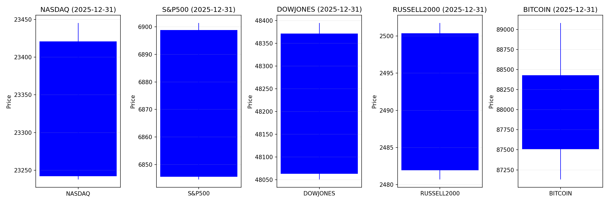
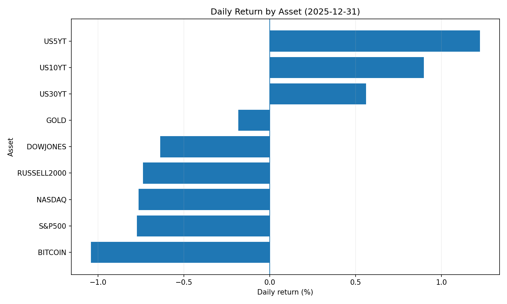
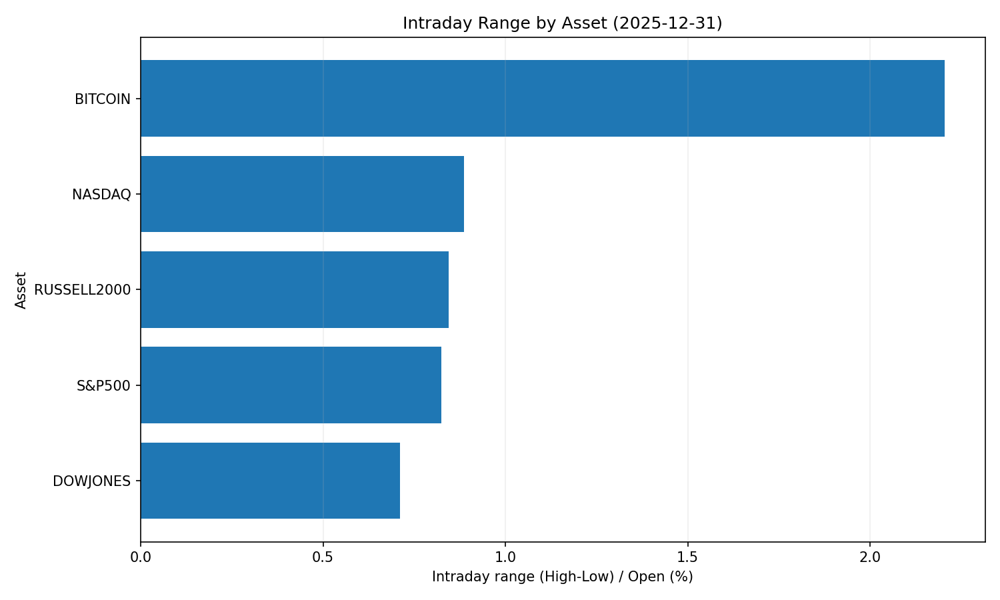
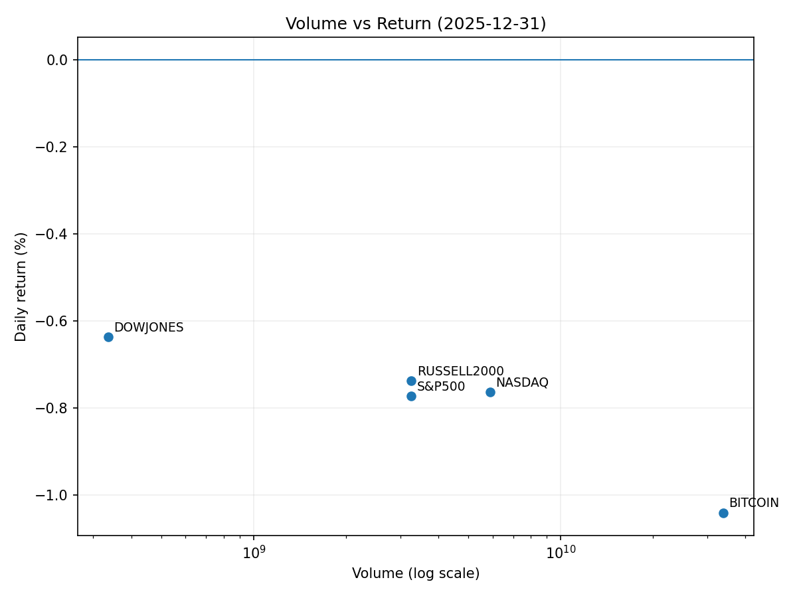

# Market Overview
| stock            | date       |      Open |      High |       Low |     Close |        Volume |   ret_pct |   range_pct |   close_over_open |   candle_dir |
|:-----------------|:-----------|----------:|----------:|----------:|----------:|--------------:|----------:|------------:|------------------:|-------------:|
| NASDAQ           | 2025-12-31 | 23420.8   | 23445.3   | 23237.8   | 23242     |   5.89513e+09 | -0.763676 |    0.885879 |          0.992363 |           -1 |
| S&P500           | 2025-12-31 |  6898.82  |  6901.42  |  6844.55  |  6845.5   |   3.26183e+09 | -0.772883 |    0.824346 |          0.992271 |           -1 |
| DOWJONES         | 2025-12-31 | 48371.5   | 48394.5   | 48050.9   | 48063.3   |   3.3606e+08  | -0.637215 |    0.710403 |          0.993628 |           -1 |
| RUSSELL2000      | 2025-12-31 |  2500.37  |  2501.77  |  2480.68  |  2481.91  |   3.26183e+09 | -0.738299 |    0.843479 |          0.992617 |           -1 |
| USD/KRW          | 2025-12-31 |  1439.55  |  1449.2   |  1437.37  |  1437.91  |   0           | -0.113926 |    0.821782 |          0.998861 |           -1 |
| Dallor Index/USD | 2025-12-31 |    98.25  |    98.5   |    98.18  |    98.28  |   0           |  0.030533 |    0.325699 |          1.0003   |            1 |
| GOLD             | 2025-12-31 |  4333.5   |  4363.8   |  4285     |  4325.6   | 785           | -0.182298 |    1.81839  |          0.998177 |           -1 |
| BITCOIN          | 2025-12-31 | 88429.6   | 89080.3   | 87130.6   | 87508.8   |   3.38302e+10 | -1.04123  |    2.20484  |          0.989588 |           -1 |
| US5YT            | 2025-12-31 |     3.677 |     3.73  |     3.675 |     3.722 |   0           |  1.22382  |    1.49579  |          1.01224  |            1 |
| US10YT           | 2025-12-31 |     4.126 |     4.173 |     4.126 |     4.163 |   0           |  0.896757 |    1.13912  |          1.00897  |            1 |
| US30YT           | 2025-12-31 |     4.813 |     4.851 |     4.81  |     4.84  |   0           |  0.56098  |    0.851857 |          1.00561  |            1 |











```markdown
## 2025-12-31 주식 및 경제 뉴스 리포트 핵심 요약

---

### 1. **오늘의 핵심 이슈**
- **인플레이션 재부상**: 소비자 물가 상승이 필수소비재 구매 및 외식 지출 위축 → 필수소비재 기업 실적 압박 및 소비심리 냉각화 심화.
- **암호화폐 시장 위기**: "크립토 윈터" 도래 전망, XRP 1달러 급락, 비트코인 장기 전망 극명히 분화(1만 달러 vs 20만 달러).
- **구리 가격 초강세**: 경기 둔화 우려에도 사상 최고가(1만 2,960달러) 경신 → 인플레이션 압력 가속화 및 제조업 원가 부담 증가.

---

### 2. **시장 동향 요약**
**🔄 주요 섹터별 흐름**
- **소비재**: 인플레이션으로 인한 소비 위축 → 필수소비재·소매업종 약세 지속, 방어주(실리콘밸리 은행) 수요 증가.
- **기술주**: AI 테마 주도 강세(반도체·클라우드 중심) → 미국 메가테크(엔비디아·테슬라) 실적 견인. 단, 단기 조정 리스크 존재.
- **원자재**:  
  - 구리·금 강세: 공급 제약·정치적 리스크(트럼프 재집권)로 상승세 지속.  
  - 은·니켈: 산업 수요 둔화로 약세 전망.
- **신흥국**: 베트남(VN 지수 +41%)·인도 니프티(3만p 목표) 호조, 내수 및 AI 테마주 유동성 유입.

**⚠️ 특이사항**
- **암호화폐 시장**: 세금 손실 매도 활성화로 단기 변동성 확대 → 기관의 저가 매집 움직임(비트마인, 이더리움 400만 개 매입).
- **정치적 리스크**: 美 중간선거·트럼프 관세 정책 재개 가능성 → 자원·무역 관련 시장 변동성 증폭.

---

### 3. **투자 시사점**
**🔍 주목해야 할 포인트**
1. **인플레이션 & 금리 정책**:  
   - 소비 위축이 경기 둔화 신호로 작용 → Fed의 금리 인하 시기 재검토 가능성.  
   - 구리 가격 급등으로 PPI 상승 압력 → 장기물 금리 상승·채권 가격 하락 리스크.
2. **섹터별 투자 전략**:  
   - **테크/AI**: 밸류에이션 리스크 존재 but 사업 다각화된 대형주 중심 편입 추천.  
   - **방어적 자산**: 인플레이션 지속 시 금·단기채권·필수소비재 우량주 헤지 활용.  
   - **원자재**: 구리 증산 CAPEX 확대 기대(광업주) vs 고원가 부담 산업(전기차) 회피.
3. **글로벌 리스크 관리**:  
   - 美 정치적 불확실성(중간선거)·규제 강화(암호화폐) 대비 포트폴리오 다각화.  
   - 신흥국 주식(베트남·인도) → 내수 견고성·AI 테마 주도력 확인 후 접근.
4. **외환 변동성**:  
   - 강달러 기조 지속 예상 → 원화 약세 리스크 대비 환헤지 전략 필수.  
   - 아시아 통화(원·위안) 약세 심화 시 수출 기업(한국 반도체) 상대적 수혜.

```
