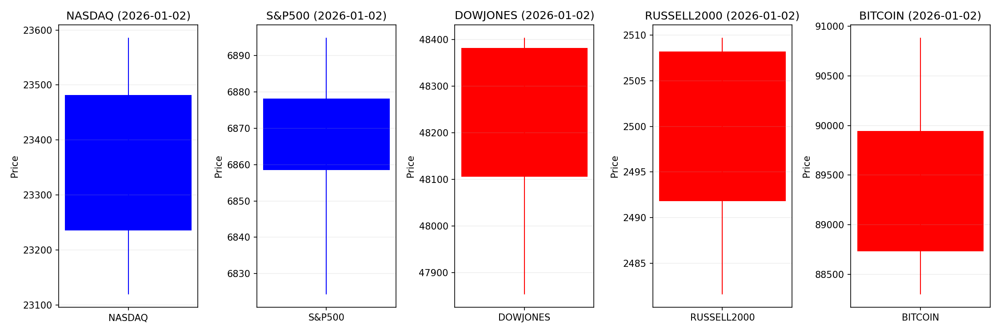
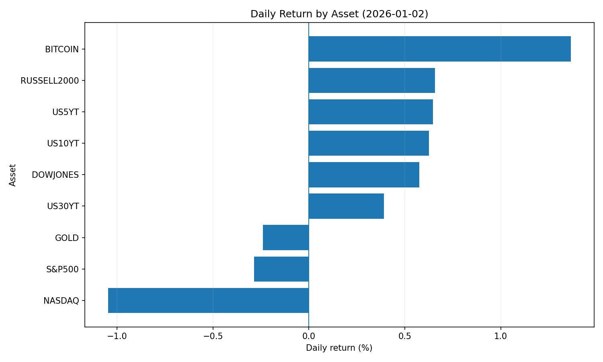
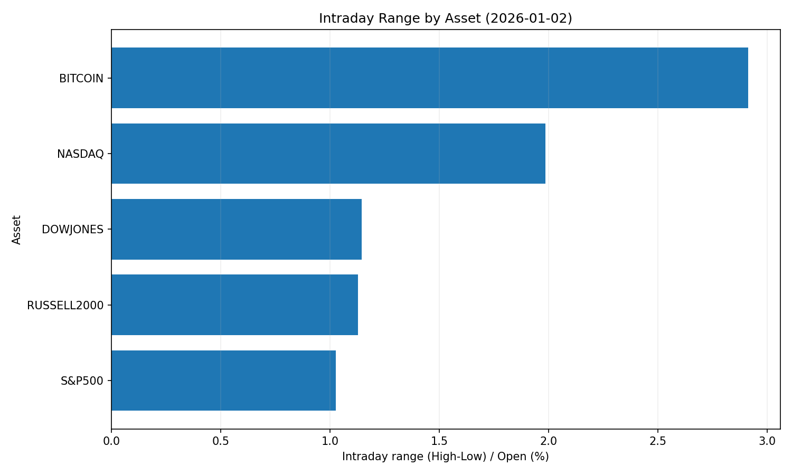
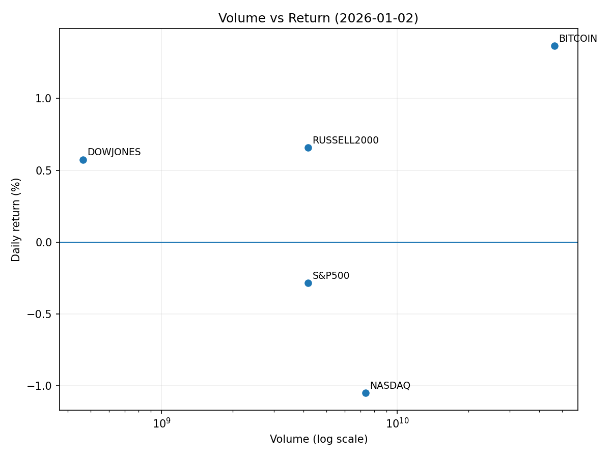

# Market Overview
| stock            | date       |      Open |      High |       Low |     Close |           Volume |   ret_pct |   range_pct |   close_over_open |   candle_dir |
|:-----------------|:-----------|----------:|----------:|----------:|----------:|-----------------:|----------:|------------:|------------------:|-------------:|
| NASDAQ           | 2026-01-02 | 23481.5   | 23586     | 23119.5   | 23235.6   |      7.33146e+09 | -1.04703  |    1.98655  |          0.98953  |           -1 |
| S&P500           | 2026-01-02 |  6878.11  |  6894.87  |  6824.31  |  6858.47  |      4.18412e+09 | -0.285538 |    1.02586  |          0.997145 |           -1 |
| DOWJONES         | 2026-01-02 | 48106     | 48404.1   | 47853     | 48382.4   |      4.6506e+08  |  0.574586 |    1.14543  |          1.00575  |            1 |
| RUSSELL2000      | 2026-01-02 |  2491.82  |  2509.72  |  2481.59  |  2508.22  |      4.18412e+09 |  0.65815  |    1.12889  |          1.00658  |            1 |
| USD/KRW          | 2026-01-02 |  1440.81  |  1446.63  |  1439.04  |  1443.64  |      0           |  0.196414 |    0.526785 |          1.00196  |            1 |
| Dallor Index/USD | 2026-01-02 |    98.235 |    98.494 |    98.145 |    98.433 |      0           |  0.201556 |    0.355277 |          1.00202  |            1 |
| GOLD             | 2026-01-02 |  4340     |  4414.8   |  4319.7   |  4329.6   | 149435           | -0.239629 |    2.19123  |          0.997604 |           -1 |
| BITCOIN          | 2026-01-02 | 88733.1   | 90884.5   | 88298.6   | 89944.7   |      4.63989e+10 |  1.36548  |    2.91418  |          1.01365  |            1 |
| US5YT            | 2026-01-02 |     3.715 |     3.748 |     3.713 |     3.739 |      0           |  0.646034 |    0.942122 |          1.00646  |            1 |
| US10YT           | 2026-01-02 |     4.161 |     4.197 |     4.159 |     4.187 |      0           |  0.62485  |    0.913245 |          1.00625  |            1 |
| US30YT           | 2026-01-02 |     4.845 |     4.875 |     4.843 |     4.864 |      0           |  0.392158 |    0.660476 |          1.00392  |            1 |

### 2026-01-02 주식 및 경제 뉴스 핵심 요약

---

#### 1. **오늘의 핵심 이슈**
1. **연준 금리 인하 기대 확대**:  
   - 나스닥 1.03% 상승, 테크주 중심 강세.  
   - 기업 실적 성장 및 금리 인하 전망이 주식 시장 호황의 주요 동력으로 작용.  
   - 향후 CPI·고용 지표 발표에 따른 변동성 주의 필요.  

2. **한미 관세 협상 성과**:  
   - 한국의 수출 7,000억 달러 돌파 및 증시 회복 견인.  
   - 대미 수출 경쟁력 강화로 무역적자 축소 및 미국 인플레이션 완화 기여.  
   - 무역 갈등 완화 신호로 아시아 TECH株 긍정적 영향 전망.  

3. **AI 투자 테마 부상**:  
   - AI·우주기술 기업 역대급 IPO 예상(스페이스X·오픈AI 등, 합산 시가총액 1.5조 달러).  
   - 피델리티·냇웨스트 "AI는 2026년 결정적 테마"라고 평가, 기술주 중심 자본 유입 심화.  
   - 무역 분쟁 및 규제 리스크에도 AI 산업 성장 동력 지속 전망.  

---

#### 2. **시장 동향 요약**
- **주요 섹터별 흐름**:  
  - **테크/반도체**:  
    - 글로벌 반도체 수요 호조(삼성전자·SK하이닉스 주가 급등) 및 2나노 공정 경쟁 가속(TSMC·인텔).  
    - AI·HPC 수요 증대로 메모리 반도체 수혜 예상.  
  - **금융/자산 토큰화**:  
    - 솔라나 기반 RWA(실물자산 토큰화) 시장 급성장(미 국채·테슬라 토큰화 주식 확대).  
    - 기관 자본 유입 촉진 및 블록체인-전통 금융 융합 가속화.  
  - **원자재**:  
    - 금 상승 전망(중앙은행 매입 확대·달러 약세 기대).  
    - 반도체·조선업 호황으로 니켈·구리 등 산업재 수요 증가.  

- **특이사항**:  
  - **환율 변동성 확대**: 원/달러 1,440원대 돌파(국민연금 해외투자 증대·미 달러 강세 지속).  
  - **암호화폐 정체**: 비트코인 9만 달러 횡보(주식 시장 대비 저조·규제 리스크 우려).  
  - **글로벌 자본 이동**: 3주간 신흥국 ←→ 선진국 자금 흐름 불안정(변동폭 ±$1,000억).  

---

#### 3. **투자 시사점**
- **주목 포인트**:  
  - **반도체·AI 테마 집중**:  
    - 글로벌 공급망 재편 및 기술 수요 증가로 삼성전자·SK하이닉스·엔비디아 등 수혜 전망.  
    - 美 대형 IPO(스페이스X 등) 참여를 통한 유동성 확대 기회 활용.  
  - **통화정책 모니터링**:  
    - 연준 금리 인하 시기·규모에 따른 위험자산 변동성 대비.  
    - 달러 강세 지속 시 신흥국 통화 약세 및 원자재 가격 조정 리스크 관리.  
  - **환율 헤징 전략**:  
    - 원/달러 변동성 확대(1,300~1,500원)에 대비한 환위험 관리 필수.  
    - 해외투자 비중 높은 기관(국민연금 등)은 환헤지 수요 증가 예상.  
  - **규제 리스크 평가**:  
    - ITC의 삼성전자 HBM 특허 조사·대중국 반도체 제재 확대 가능성 대응.  
    - RWA·토큰화 자산에 대한 SEC 규제 변화 전망에 따른 포트폴리오 조정.  

- **회피 요소**:  
  - 비트코인 노출도 높은 기업(마이크로스트레티지 등) 재무 건전성 리스크.  
  - 무역 분쟁 장기화로 인한 인플레이션 재발 가능성(특히 관세 의존 산업).  

--- 

**✍️ 한줄 요약**: 연준 금리 인하 기대·한미 무역 협상 성과·AI 테마가 시장 흐름 주도, 반도체/테크주 강세 지속 시나리오에 집중하되 환율 변동성 및 규제 리스크 관리 필수.
