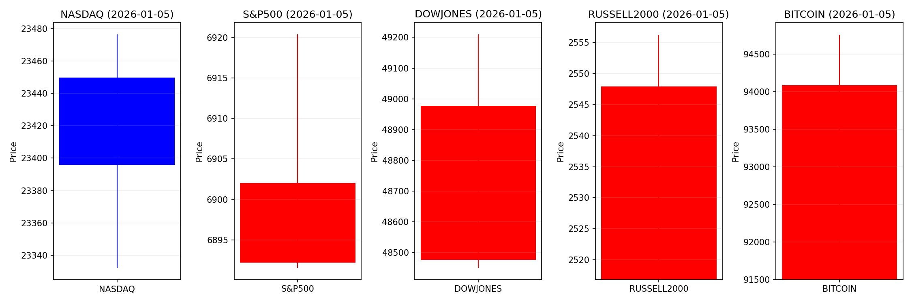
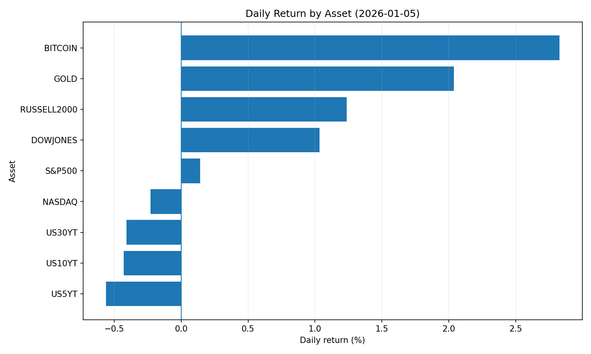
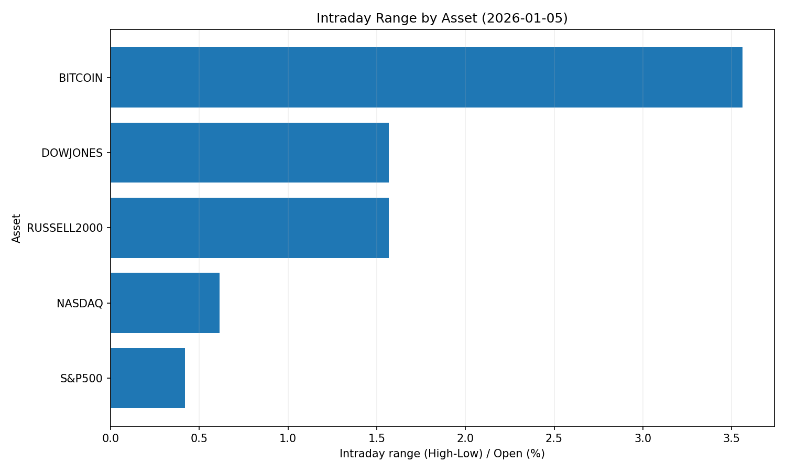
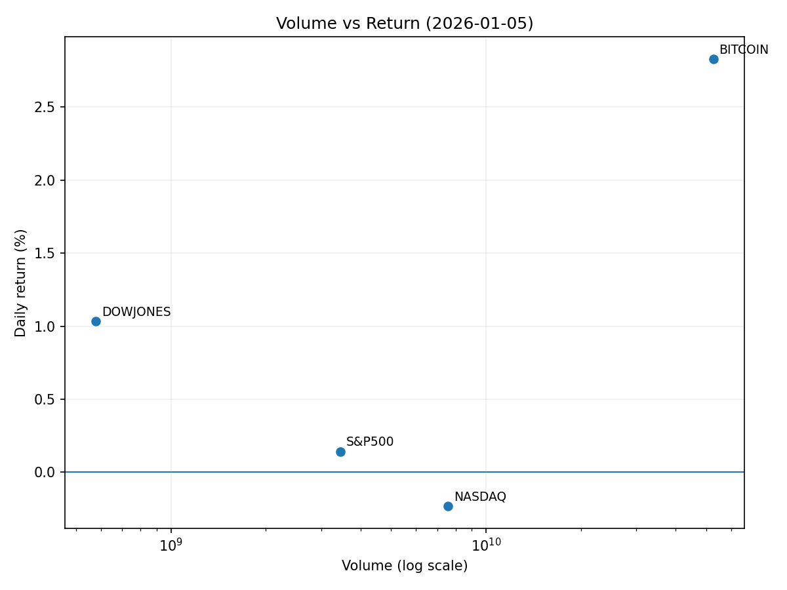

# Market Overview
| stock            | date       |      Open |      High |       Low |     Close |           Volume |   ret_pct |   range_pct |   close_over_open |   candle_dir |
|:-----------------|:-----------|----------:|----------:|----------:|----------:|-----------------:|----------:|------------:|------------------:|-------------:|
| NASDAQ           | 2026-01-05 | 23449.7   | 23476.5   | 23332.2   | 23395.8   |      7.58523e+09 | -0.229622 |    0.615281 |          0.997704 |           -1 |
| S&P500           | 2026-01-05 |  6892.19  |  6920.38  |  6891.56  |  6902.05  |      3.44955e+09 |  0.143058 |    0.418152 |          1.00143  |            1 |
| DOWJONES         | 2026-01-05 | 48475.8   | 49209.9   | 48449.6   | 48977.2   |      5.78613e+08 |  1.03427  |    1.56847  |          1.01034  |            1 |
| RUSSELL2000      | 2026-01-05 |  2516.81  |  2556.24  |  2516.81  |  2547.92  |      0           |  1.23625  |    1.56698  |          1.01236  |            1 |
| USD/KRW          | 2026-01-05 |  1444.5   |  1449.79  |  1442.18  |  1445.22  |      0           |  0.049842 |    0.526825 |          1.0005   |            1 |
| Dallor Index/USD | 2026-01-05 |    98.481 |    98.861 |    98.251 |    98.318 |      0           | -0.165516 |    0.619409 |          0.998345 |           -1 |
| GOLD             | 2026-01-05 |  4368.3   |  4467.6   |  4354.6   |  4457.3   | 206393           |  2.03741  |    2.58682  |          1.02037  |            1 |
| BITCOIN          | 2026-01-05 | 91498     | 94757.5   | 91498     | 94085.3   |      5.2756e+10  |  2.82768  |    3.56236  |          1.02828  |            1 |
| US5YT            | 2026-01-05 |     3.731 |     3.737 |     3.701 |     3.71  |      0           | -0.562862 |    0.964895 |          0.994371 |           -1 |
| US10YT           | 2026-01-05 |     4.183 |     4.191 |     4.153 |     4.165 |      0           | -0.430316 |    0.908441 |          0.995697 |           -1 |
| US30YT           | 2026-01-05 |     4.874 |     4.88  |     4.843 |     4.854 |      0           | -0.41034  |    0.759134 |          0.995897 |           -1 |











```markdown
# 2026-01-05 투자 리포트 핵심 요약

## 1. 오늘의 핵심 이슈
### ① 기관의 암호화폐 대규모 매입 확대
- **비트마인** 33,000 ETH 추가 매입으로 총 보유액 142억 달러 돌파  
- 기관의 디지털 자산 투자 가속화 (전체 ETH 공급량 3.43% 보유)  
- 1월 15일 주주총회서 주식 발행 한도 확대 안건 논의 예정

### ② 베네수엘라 지정학적 리스크 고조
- 美의 마두로 대통령 체포 발표로 유가 변동성↑ 및 안전자산 수요 증대  
- WTI 유가 5% 급등 가능성, 금價 상승 모멘텀 지속  
- 달러 강세 심화로 신흥국 통화(원화·위안화) 약세 압력

### ③ 한국 증시 사상 최고가 달성
- KOSPI 4,400선 돌파 (반도체주 견인, 외국인 순매수 2조 원↑)  
- 연준 금리 인하 기대감에 신흥국 유동성 유입 확대  
- "붉은 말의 해" 상징적 효과로 시장 심리 개선

---

## 2. 시장 동향 요약
### 글로벌 자산군
- **암호화폐**  
  - 시총 3.25조 달러 회복, ETH·알트코인으로 투자 다각화  
  - 비트코인 9.3만 달러 돌파 (ETF 유입 4.71억 달러)  
  - xStocks(애플·엔비디아 토큰화) 4.57억 달러 거래 기록

- **주식**  
  - 美 테크/성장주 : 위험 감수 심리(Risk-on) 확대  
  - 아시아 기술주 : 日 엔화 약세 수혜(수출 경쟁力↑), 대만·한국 반도체株 강세  
  - 美 방산주 : 베네수엘라 리스크로 락히드마틴 등 수혜

- **채권/안전자산**  
  - 미 국채·TIPS 수요↑ (연금펀드 안정성 추구)  
  - 금 1돈 90만 원 돌파 ("황금 귀환" 현상)  
  - 韓 채권형 펀드 40조 원 돌파 (고금리 대응 수요)

### 지역별 동향
- **미국** : ETF 유입 확대→신상품 개발 경쟁 가속화  
- **아시아** : 엔·위안 약세 지속, 기술주 중심 랠리  
- **한국** : 원/달러 1,440원대, FX스와프 프리미엄↑ (외국인 유입 심화)  

---

## 3. 투자 시사점
### 📈 주목해야 할 5대 포인트
1. **암호화폐 기관화 모니터링**  
   - 거래소 BitMine, 비트코인 ETF 유입 동향 분석  
   - SEC 규제 강화 시 변동성↑ 대비 전략 필요

2. **지정학적 리스크 헤지 전략**  
   - 베네수엘라 유공급 차질 시 에너지株 편입  
   - 안전자산(금·미 국채) 비중 조정 검토

3. **AI·반도체 업종 분화 전략**  
   - 美 대형 테크주 vs. 한국·대만 2차전지·반도체株 밸류에이션 차이 활용  
   - RWA(실물자산 토큰화) 연계 기업(엔비디아·테슬라) 관심

4. **금리 정책 변화 대응**  
   - 연준 완화 기대에 신흥국 주식·채권 노출 확대  
   - 달러 강세 지속 시 원자재 수출기업(철강·화학) 리스크 관리

5. **한국 증시 과열 신호 점검**  
   - 외국인 순매수 2조 원↑ 지속성 평가  
   - KOSPI 4,400선 돌파 후 매수력 검증 필요
```
