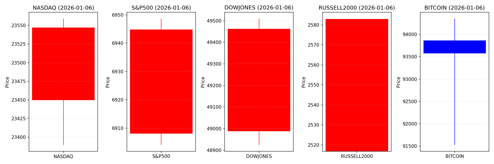
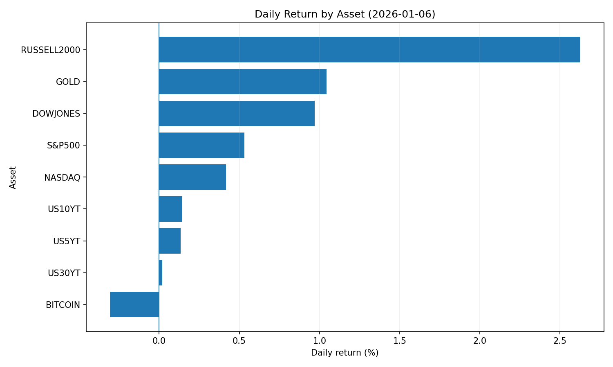
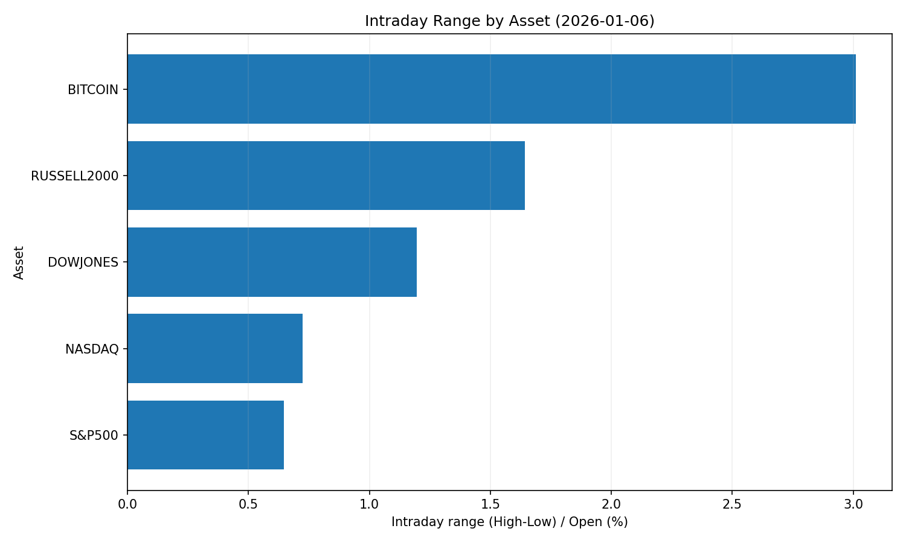
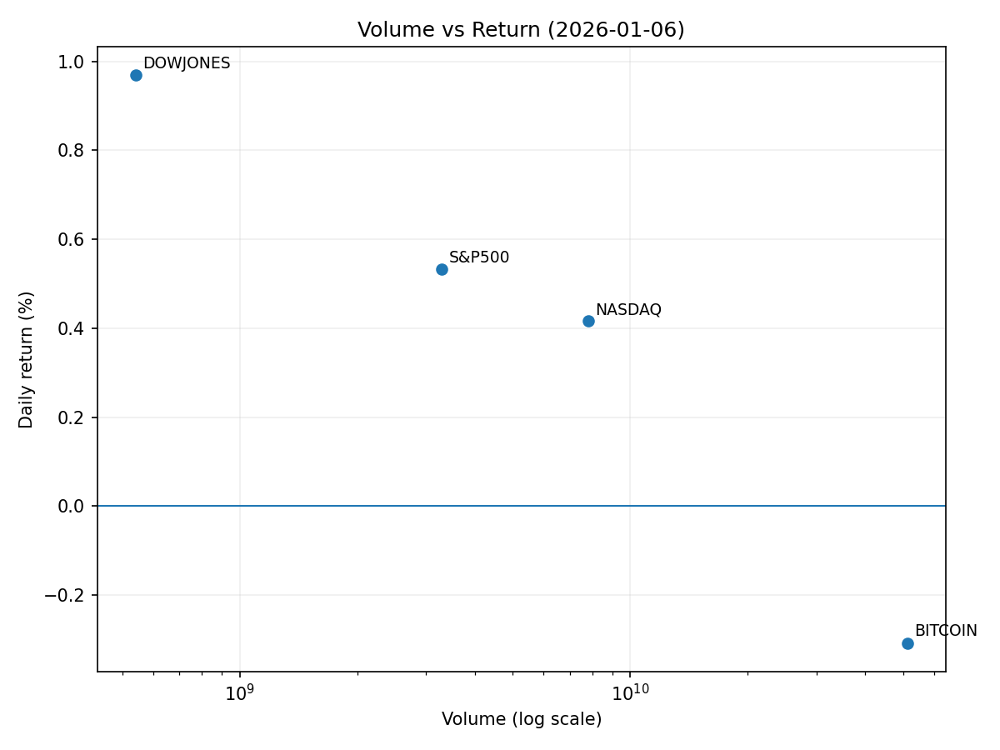

# Market Overview
| stock            | date       |      Open |      High |       Low |     Close |           Volume |   ret_pct |   range_pct |   close_over_open |   candle_dir |
|:-----------------|:-----------|----------:|----------:|----------:|----------:|-----------------:|----------:|------------:|------------------:|-------------:|
| NASDAQ           | 2026-01-06 | 23449.7   | 23559.2   | 23389.6   | 23547.2   |      7.80369e+09 |  0.415801 |    0.723175 |          1.00416  |            1 |
| S&P500           | 2026-01-06 |  6908.03  |  6948.69  |  6904.02  |  6944.82  |      3.29113e+09 |  0.532569 |    0.646638 |          1.00533  |            1 |
| DOWJONES         | 2026-01-06 | 48987.4   | 49509.9   | 48923.8   | 49462.1   |      5.41263e+08 |  0.969064 |    1.19642  |          1.00969  |            1 |
| RUSSELL2000      | 2026-01-06 |  2516.81  |  2582.99  |  2541.63  |  2582.9   |      0           |  2.62604  |    1.6436   |          1.02626  |            1 |
| USD/KRW          | 2026-01-06 |  1446.48  |  1449.38  |  1441.78  |  1447.48  |      0           |  0.069133 |    0.525412 |          1.00069  |            1 |
| Dallor Index/USD | 2026-01-06 |    98.411 |    98.626 |    98.161 |    98.614 |      0           |  0.206273 |    0.472504 |          1.00206  |            1 |
| GOLD             | 2026-01-06 |  4459.8   |  4503.7   |  4437.9   |  4506.3   | 166520           |  1.04265  |    1.47541  |          1.01043  |            1 |
| BITCOIN          | 2026-01-06 | 93861.7   | 94352.7   | 91526.3   | 93573     |      5.13076e+10 | -0.307567 |    3.01125  |          0.996924 |           -1 |
| US5YT            | 2026-01-06 |     3.715 |     3.724 |     3.708 |     3.72  |      0           |  0.134586 |    0.430687 |          1.00135  |            1 |
| US10YT           | 2026-01-06 |     4.173 |     4.181 |     4.165 |     4.179 |      0           |  0.143782 |    0.383424 |          1.00144  |            1 |
| US30YT           | 2026-01-06 |     4.865 |     4.884 |     4.854 |     4.866 |      0           |  0.020553 |    0.616644 |          1.00021  |            1 |

# 2026-01-06 투자 리포트 핵심 요약

## 1. 오늘의 핵심 이슈
### ① **원/달러 환율 4일 연속 상승**
- 환율 **1,445.5원** 돌파 (전년 대비 +1.7원)
- **외국인 주식 순매도**(6,180억 원) 및 글로벌 달러 강세 지속이 주원인  
- 연준 금리 인하 지연 예상과 베네수엘라 리스크가 변동성 확대

### ② **암호화폐 시장 급등**
- **비트코인 93,000달러 회복**, XRP ETF 일일 **4,610만 달러 순유입**  
- 모건 스탠리 비트코인/솔라나 현물 ETF 추진으로 기관 투자 확대 전망  
- 지정학적 리스크에도 "디지털 안전자산" 수요 증가

### ③ **베네수엘라 지정학적 리스크 확대**
- 미군 개입 가능성 및 정유사 주가 변동성 심화  
- 원유 공급 차질 우려(**브렌트유 90달러/배럴 도전**) vs 美 정유사 수혜 기대

---

## 2. 시장 동향 요약
### ▫️ **외환시장**
- **달러 강세** 지속 : DM 통화 대비 우세 ↑  
- 원화·엔·아세안 통화 약세 심화 (대외불확실성 노출)  
- 환율 리스크 헤지 수요 증가 → 스테이블코인·금 투자 확대

### ▫️ **주식시장**
- **미국**: 테크/에너지 강세 (반도체·정유사)  
- **한국**: KOSPI 4,500선 돌파했으나 외국인 6,305억 원 순매도 발생  
- **신흥국**: 무역 갈등·자본 유출로 하방 압력(인도 -6.7% 급락)

### ▫️ **채권**
- **미 국채 수요 증가**(안전자산 선호) vs **단기 금리 상승 압력**  
- 크레딧·인프라債 매력도 ↑ (사모펀드 전략 변화 반영)

### ▫️ **암호화폐**
- **ETF 유입**+**기관화** 가속으로 시총 3.29조 달러 신고점  
- RWA(실물자산 토큰화) 시장 성장 리드 (시큐라타이즈 34억 달러 AUM 목표)

### ▫️ **원자재**
- **유가**: 지정학적 리스크로 변동성 ↑ vs **금**: 비트코인과 역상관관계 재부각  
- 구리·리튬 수요 증가 (AI·전기차 산업 호조)

---

## 3. 투자 시사점
### 🔍 **포커스 포인트**
- **달러-원 환율 모니터링**: 1,450원 돌파 시 수출기업 실적 압력 ↑  
- **연준 금리 정책 시그널**: 12월 서비스업 PMI·ISM 비제조업 지표 분석 필수  
- **코스피 리스크 관리**: 외국인 매도 확대 가능성 vs 반도체주 수혜 지속성  

### ✅ **투자 전략**
- **장기 포트폴리오 재편**:  
  - 매력 섹터: 美 테크(인공지능·블록체인), 인프라債, RWA 토큰화 테마  
  - 회피 섹터: 원화 약세 노출 多 한국 내수주, 신흥국 채권  
- **헤지 전략 강화**:  
  - 환율 변동성 ↑ → 달러 페그 스테이블코인·미 국채 ETF 편입  
  - 지정학적 리스크 ↑ → 에너지주(정유사) 및 금 5% 편성 권고  
- **테마별 접근**:  
  > - ESG 테마: 글로벌 펀드 유입 확대(유럽 그린에너지·美 전기차)  
  > - 반도체 2차 수혜: 팹리스 소재(니켈·구리) 및 장비업체  
  > - 암호화폐 ETF: 모건 스탠리·블랙록 상품 롱텀 편입  

### ⚠️ **리스크 관리**
- **단기 변동성 유발 요인**:  
  - 트럼프 행정부 대외정책(베네수엘라·관세)  
  - 서학개미의 美 주식 집중 매도 가능성(VIX 30↑ 시 유동성 충격)  
- **모니터링 리스트**:  
  > - 원/달러 1,450원, 비트코인 10만 달러 돌파 여부  
  > - 연준의 크레딧 시장 리스크 평가(상업부동산 대출 부실화)  

> 📌 **결론**: **"강달러 + 테크&에너지 편중 + 암호화폐 기관화"** 트렌드 하에서 안전자산(美 국채)과 성장 자산(반도체·AI)의 **5:5 밸런싱 전략** 권고. 환율 변동성 대비 원화 약세 헤지 필수.
