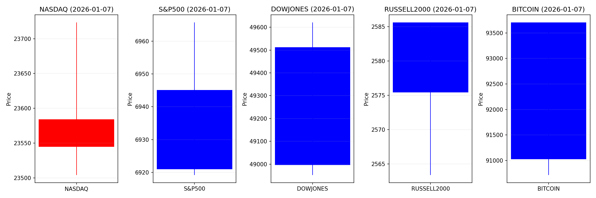
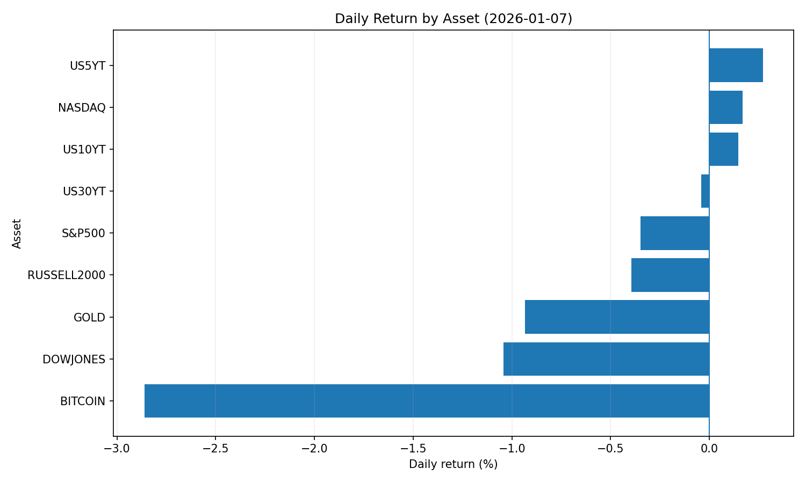
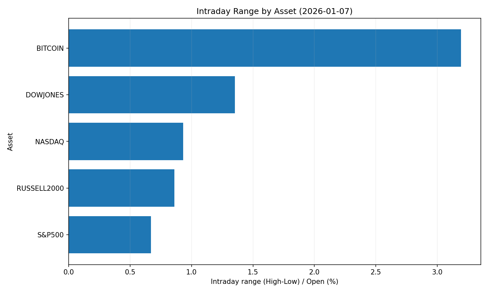
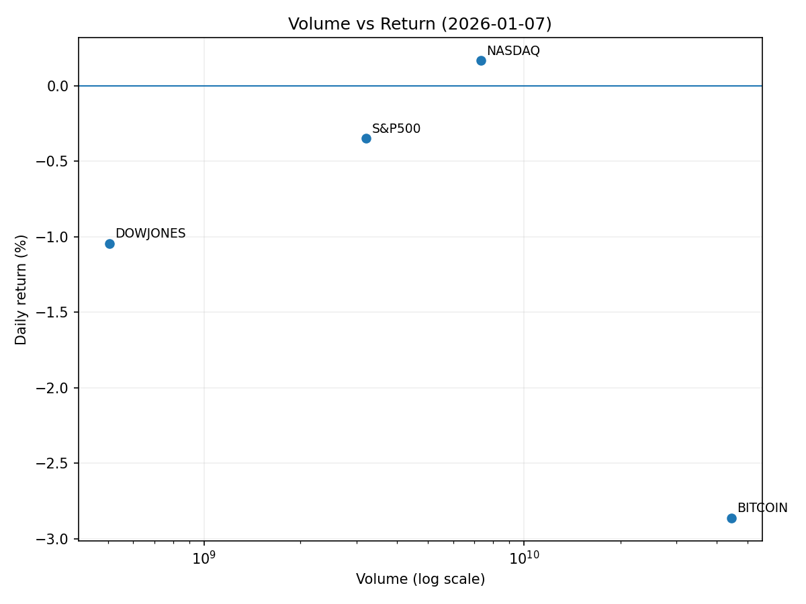

# Market Overview
| stock            | date       |      Open |      High |       Low |     Close |           Volume |   ret_pct |   range_pct |   close_over_open |   candle_dir |
|:-----------------|:-----------|----------:|----------:|----------:|----------:|-----------------:|----------:|------------:|------------------:|-------------:|
| NASDAQ           | 2026-01-07 | 23544.9   | 23723.4   | 23504.2   | 23584.3   |      7.3353e+09  |  0.167259 |    0.930777 |          1.00167  |            1 |
| S&P500           | 2026-01-07 |  6945.07  |  6965.69  |  6919.19  |  6920.93  |      3.21229e+09 | -0.34758  |    0.66954  |          0.996524 |           -1 |
| DOWJONES         | 2026-01-07 | 49512.7   | 49621.4   | 48952     | 48996.1   |      5.06187e+08 | -1.04345  |    1.35206  |          0.989565 |           -1 |
| RUSSELL2000      | 2026-01-07 |  2585.62  |  2585.62  |  2563.4   |  2575.42  |      0           | -0.394261 |    0.85949  |          0.996057 |           -1 |
| USD/KRW          | 2026-01-07 |  1445.97  |  1450.41  |  1445.41  |  1449.43  |      0           |  0.239291 |    0.345789 |          1.00239  |            1 |
| Dallor Index/USD | 2026-01-07 |    98.579 |    98.747 |    98.497 |    98.745 |      0           |  0.168393 |    0.253604 |          1.00168  |            1 |
| GOLD             | 2026-01-07 |  4505.4   |  4512.4   |  4432.9   |  4463.3   | 196608           | -0.934436 |    1.76455  |          0.990656 |           -1 |
| BITCOIN          | 2026-01-07 | 93707.1   | 93707.1   | 90714     | 91026.4   |      4.44679e+10 | -2.86078  |    3.19415  |          0.971392 |           -1 |
| US5YT            | 2026-01-07 |     3.684 |     3.713 |     3.675 |     3.694 |      0           |  0.271437 |    1.03149  |          1.00271  |            1 |
| US10YT           | 2026-01-07 |     4.132 |     4.161 |     4.124 |     4.138 |      0           |  0.145209 |    0.895454 |          1.00145  |            1 |
| US30YT           | 2026-01-07 |     4.817 |     4.844 |     4.807 |     4.815 |      0           | -0.041517 |    0.768107 |          0.999585 |           -1 |











```markdown
# 2026-01-07 투자 리포트 핵심 요약

## 1. 오늘의 핵심 이슈
### (1) 금리 인하 기대감 확대 vs. 불확실성 병존
- **ADP 고용 지표 약세**로 연준의 금리 인하 시점 앞당겨질 것이라는 시장 기대 ▶ 기술주 중심 반등 유도
- 단, **암호화폐 시장 조정** 발생(비트코인 9만 달러 횡보) ▶ 금리 정책 불확실성 영향
- **국가부채 38.5조 달러 돌파**로 저금리 장기화에 따른 자산 버블 리스크 경고

### (2) 원화 약세 장기화 추세
- **원/달러 환율 5일 연속 상승** (최고 1,449원, 종가 1,445.8원) ▶ 달러 헤지 수요 + 지정학적 리스크(트럼프 그린란드 논의 등) 주도
- 국내 투자자 **미국 주식 순매수 확대** (1월 5일 4.58억 달러) 유동성 유출 부담

### (3) 암호화폐 제도권 진출 심화
- **SEC, 체인링크(LINK) 현물 ETF 승인** ▶ 최초 알트코인 주식시장 진출
- **스테이블코인 규제체계 정착**(GENIUS법 기반) ▶ 기관 투자 확대 가능성
- **RWA(실물자산 토큰화) 시장 3배 성장** ▶ 글로벌 유동성 재편 영향력 증대

---

## 2. 시장 동향 요약
### 🔵 주식 시장
- **美 테크주 강세**  
  - 반도체/AI 수요 호조(美 반도체주 상승 → 日·韓 반도체株 동반 상승)  
  - 암호화폐 ETF 확대(체인링크·스페이스X IPO 기대) 블록체인 테마 주목  
- **아시아 시장 양극화**  
  - 베트남(수출 호조로 VN지수 사상 최고), 한국(코스피 2,600선 돌파)  
  - 中·日 지정학적 리스크(희토류 통제)로 제조업株 변동성 확대  

### 🟢 외환 시장
- **달러 강세 고착화**  
  - 원/달러 환율 상승세(5거래일 ↑) ▶ 아시아 통화 약세 심화(엔화·위안화)  
  - 지리정치학적 불확실성 + 美 금리 장기화 기대  
- **원화 유동성 감소 우려**  
  - 국내 서학개미 242조 원 투자 집중 ▶ 환율 상승에 따른 수입물가 압력  

### 🟣 암호화폐 시장
- **기관화 가속**  
  - 현물 ETF 승인(체인링크), RWA 토큰화 확대(MFF·美 주식 7,500억 달러 유입)  
- **변동성 확대**  
  - 비트코인 채굴기업(Riot 등) 실적 호조에도 주가 급락 ▶ 과열 신호  

---

## 3. 투자 시사점
### 🔥 핵심 모니터링 포인트
1. **미 고용·물가 데이터**  
   - ADP 고용동향 → 연준 금리 인하 시기 전망 재평가 필요  
2. **원/달러 환율 1,450원 돌파 여부**  
   - 수출기업(반도체·조선) 실적 호전 vs. 수입인플레이션 리스크  
3. **희토류 공급망 재편**  
   - 中 수출 통제 확대 시 美·韓 대체소재 개발기업(수소차·배터리) 수혜  

### 💡 전략적 포트폴리오 대응
| 자산군       | 기회 요소                      | 리스크 요소                     |
|--------------|-------------------------------|--------------------------------|
| **주식**     | 美 반도체·AI 테마주            | 지정학적 리스크(中 희토류 통제)  |
| **채권**     | 단기 미 국채(변동성 헤지)      | 장기채 금리 상승 압력           |
| **원자재**   | 금·희토류*(인플레이션 헤지)*   | 강달러 기조 하 원유 하방 압력   |
| **암호화폐** | 알트코인 ETF 확대 테마         | 비트코인 변동성 확대            |

> ⚠️ **리스크 관리 필수**  
> - 美 저금리 기조 한계점(국가부채 38.5조 달러) ↓ 자산 버블 경고  
> - 신흥국 통화 약세 장기화 ↓ 美 수출 경쟁력 저하 가능성  
```
