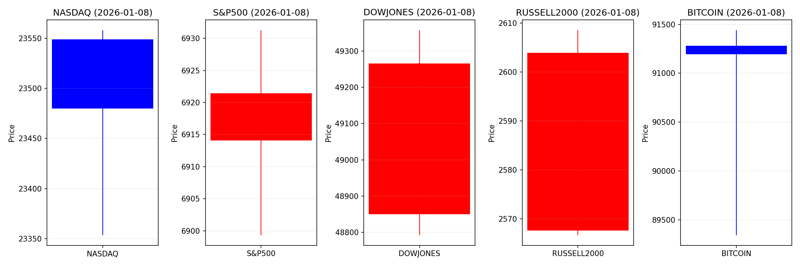
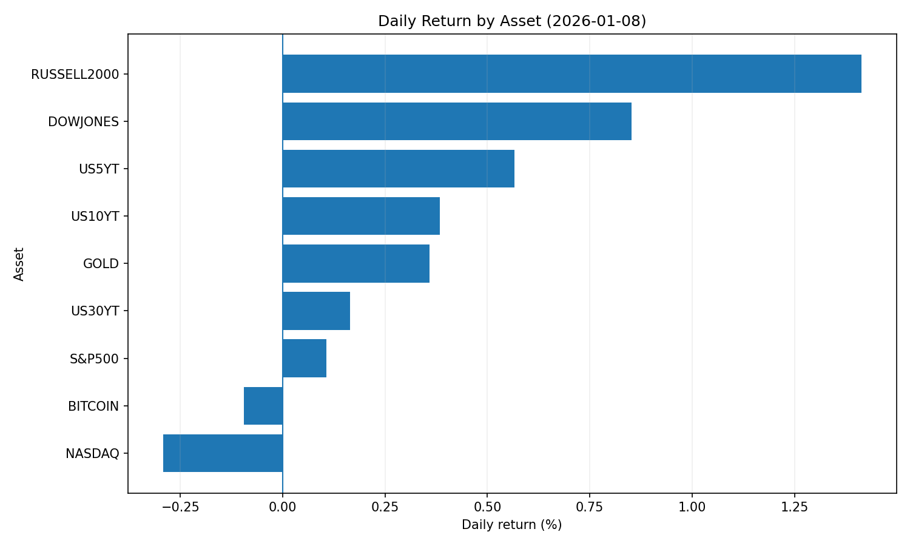
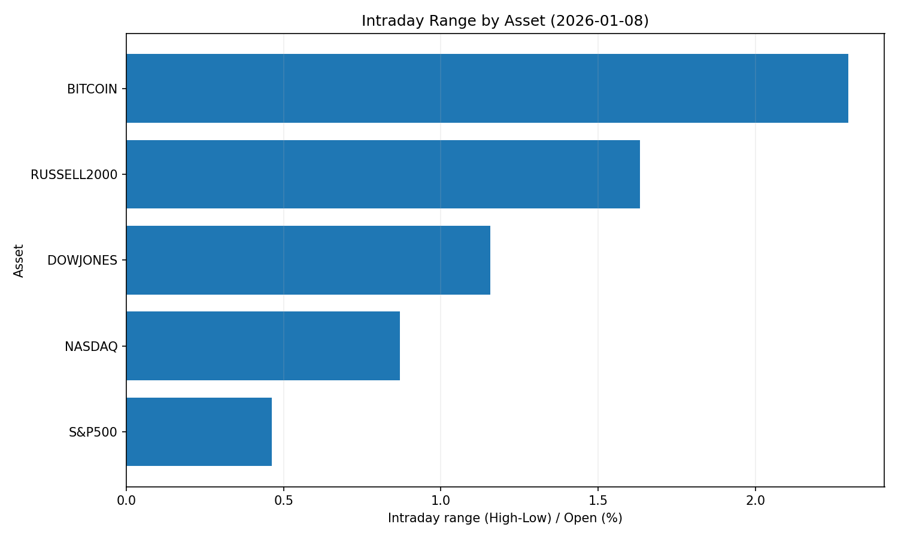
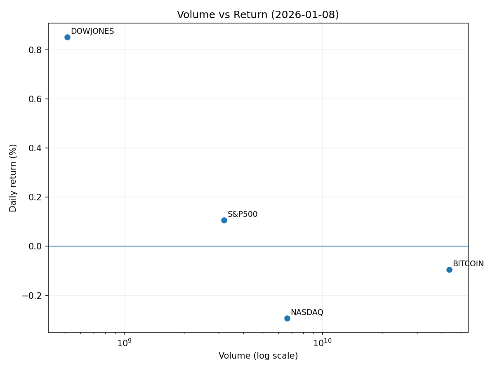

# Market Overview
| stock            | date       |      Open |      High |       Low |     Close |           Volume |   ret_pct |   range_pct |   close_over_open |   candle_dir |
|:-----------------|:-----------|----------:|----------:|----------:|----------:|-----------------:|----------:|------------:|------------------:|-------------:|
| NASDAQ           | 2026-01-08 | 23548.9   | 23558.2   | 23353.5   | 23480     |      6.62455e+09 | -0.292452 |    0.869285 |          0.997075 |           -1 |
| S&P500           | 2026-01-08 |  6914.11  |  6931.28  |  6899.33  |  6921.46  |      3.18487e+09 |  0.106306 |    0.462094 |          1.00106  |            1 |
| DOWJONES         | 2026-01-08 | 48850.2   | 49357.7   | 48792.3   | 49266.1   |      5.15076e+08 |  0.851456 |    1.15741  |          1.00852  |            1 |
| RUSSELL2000      | 2026-01-08 |  2567.61  |  2608.57  |  2566.66  |  2603.91  |      0           |  1.41355  |    1.63244  |          1.01414  |            1 |
| USD/KRW          | 2026-01-08 |  1447.15  |  1454.3   |  1447     |  1452.52  |      0           |  0.371074 |    0.504443 |          1.00371  |            1 |
| Dallor Index/USD | 2026-01-08 |    98.736 |    98.984 |    98.679 |    98.874 |      0           |  0.139767 |    0.308905 |          1.0014   |            1 |
| GOLD             | 2026-01-08 |  4467.1   |  4489.3   |  4415     |  4483.1   | 190823           |  0.358174 |    1.66327  |          1.00358  |            1 |
| BITCOIN          | 2026-01-08 | 91280.7   | 91440.6   | 89345     | 91194     |      4.36304e+10 | -0.094942 |    2.29578  |          0.999051 |           -1 |
| US5YT            | 2026-01-08 |     3.715 |     3.741 |     3.711 |     3.736 |      0           |  0.565273 |    0.807536 |          1.00565  |            1 |
| US10YT           | 2026-01-08 |     4.167 |     4.187 |     4.161 |     4.183 |      0           |  0.383976 |    0.623939 |          1.00384  |            1 |
| US30YT           | 2026-01-08 |     4.85  |     4.862 |     4.842 |     4.858 |      0           |  0.164956 |    0.412371 |          1.00165  |            1 |

# 2026년 1월 8일 투자 분석 리포트 요약

## 1. 오늘의 핵심 이슈
### ① **달러 강세 지속 심화**
- 원·달러 환율 6거래일 연속 상승(1450원대 돌파), 글로벌 신흥국 통화 약세 유발
- 미 경제지표 호조(고용·소비)·Fed 금리 인하 시기 불확실성 등 복합 요인 작용
- 글로벌 자금 유입 집중으로 달러 패권 재강조

### ② **글로벌 자본의 미 증시 편중 현상**
- 한국 서학개미 2026년 초 미주식 순매수 12억 달러↑(테슬라·엔비디아 등 빅테크 중심)
- 국내 ETF 시가총액 300조 원 돌파, 해외주식형 비중 확대(17.2%)로 미 시장 유동성 지원
- 알파벳 시총 2위 재탈환(제미나이 AI 성장 기대), 엔비디아와의 AI 주도권 경쟁 격화

### ③ **통화정책 불확실성 리스크 상승**
- 연준 금리 인하 시점 예측 난항 → 미 국채 금리 변동성 확대
- 신흥국 통화 약세 심화로 달러화 헤징 수요 증가(원·위안화 등 아시아 통화 취약)
- 금값 급등(3,932톤 ETF 보유) 등 안전자산 선호 현상 확대

---

## 2. 시장 동향 요약
### 🇺🇸 **미국 주식 시장**
- **AI 테크주 강세 지속**: 엔비디아(시총 4.5조$) → 알파벳(구글)·메타 순매수 확대
- **소매투자자 영향력 증대**: 한국 개인 투자자 연간 8,762억 원 규모 구글 주식 순매수
- **ETF 유동성 재편**: SOL ETF 유동성 반등(3억$ 일일거래량), RWA(실물자산 토큰화) 플랫폼 성장

### 🌏 **아시아 통화 및 신흥국**
- **원화 약세 고착**: 외국인 순매도(1천억 원)+수입업체 달러 매수 확대 → 환율 상승 압력
- **日·中 주식 상대적 약세**: 미 증시 조정 시 차익매물 선행(다우지수 0.94%↓ → 일본 은행주 약세)
- **중국 부상 신호**: 2025~27년 성장률 상향 전망 → 밸류에이션 매력도 부각

### 🏦 **자산군별 흐름**
- **환율**: USD 강세 심화 → 원화·아시아 통화 리스크 프리미엄 확대
- **채권**: 미 국채 수요 안정 vs 신흥국 채권 변동성↑(달러 표시 부채 부담↑)
- **원자재**: 달러 강세 → 금·석유 등 USD 표시 자산 가격 하방 압력
- **사모대출**: 은행 대체 수단으로 급성장(레버리지 거래↑ → 쉐도우 뱅킹 리스크)

---

## 3. 투자 시사점
### 🔑 **주목 포인트**
- **달러 헤징 전략 확보**: 원화 약세 지속성 고려, 미 국채·달러 예금 등 통화리스크 대비자산 배분
- **AI 인프라 테마 집중**: 빅테크(엔비디아·구글) + 반도체 수혜종목(고성능 GPU 관련 수급망)
- **글로벌 유동성 재편 모니터링**: 연준 금리 정책 시그널 → 위험자산 변동성 대응

### ⚠️ **리스크 관리 필수**
- **신흥국 자산 노출 제한**: 달러 강세→자본유출 심화로 신흥국 주식·채권 하방압력
- **테크주 과열 평가 리스크**: AI 관련株 밸류에이션 리밸런싱 가능성 대응
- **규제 환경 변화**: 국내 공정거래법 강화(과징금 20%↑) → 재벌 계열사 주가 변동성↑

### 💡 **전략적 기회**
- **대미 수출 기업 편입**: 원화약세 수혜(K-화장품·수산업 등 글로벌 진출 로컬 기업)
- **실물자산 대체 투자**: 금·은 등 안전자산 + RWA(토큰화 부동산) 포트폴리오 다각화
- **中 저평가 밸류株**: 경제성장률 상향 전망에 따른 중장기 리밸런싱 기대

> **📌 결론**: 달러 강세 기조와 AI 테마를 선도하는 미 증시 편중 현상이 지속될 전망. 통화정책 불확실성 하에서 신흥국 리스크 회피 및 실물자산 비중 확대가 핵심 전략으로 부상. 원화 약세 지속성에 따라 환율 헤징 수단(달러 예금·미 국채)과 수출주 편입을 적극 검토해야 할 시점입니다.
